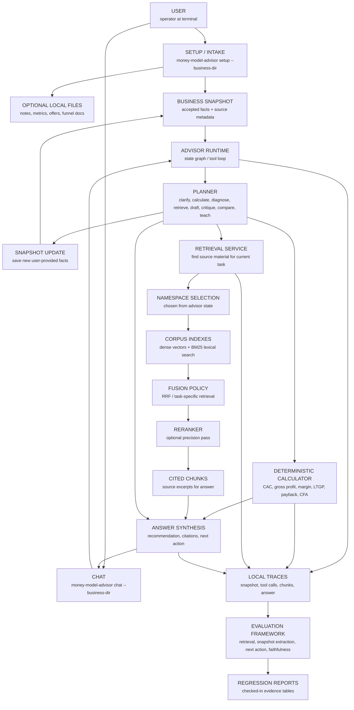

# Money Model Architect — Architecture & Reasoning

A CLI-first, stateful money-model advisor over Alex Hormozi's *$100M Money Models*, built to mirror — line for line — the [Senior AI Engineer JD at Acquisition.com](https://jobs.ashbyhq.com/acquisition/9789dd49-c6bd-4672-8cd3-9f67f2dea7c1) (ACQ Vantage).

This document explains **why** every piece is shaped the way it is. The corresponding code lives in the rest of the repo.

---

## 1. Why this corpus, this product

**Corpus:** the full source set lives in [`corpus/`](corpus/README.md) — 32 chapter transcripts of Hormozi's *$100M Money Models*, plus a prior coaching artifact (decision trees, diagnostic flow, worked examples, system instructions) and a hand-distilled frameworks summary. The coaching artifact is the prior art for the `diagnose_constraint` / `critique_offer` tool logic; the examples seed the golden eval set.

**Product:** a Hormozi money-model advisor — a local CLI agent with deep recall of the entire book plus a saved `BusinessSnapshot` for the business being advised. It handles the full range of things a founder would ask Hormozi himself:

- **Diagnose** — "here are my numbers, what's the constraint?" (CAC, payback, missing continuity, weak attraction offer, etc.)
- **Design** — build an offer stack, design a specific upsell, structure a continuity program, pick an attraction offer for a given ICP.
- **Critique** — "here's my current funnel / pricing / offer — what would Hormozi push back on?"
- **Calculate** — payback period, CAC ratios, gross profit, LTV scenarios — using the formulas from the book, deterministically.
- **Compare** — "rollover vs. classic upsell for a coaching business" — explain tradeoffs with citations.
- **Teach** — explain a framework on demand, with the original examples.

**Why this combination:**

- The book is Acquisition.com's own IP, and the advisor shape mirrors what ACQ Vantage actually does — advisory AI for portfolio companies — not a single-purpose generator.
- The book has natural conceptual layers (offer types, upsells, downsells, continuity, unit economics). Layers map cleanly to Pinecone namespaces, which is the exact thing the JD asks me to "own and improve."
- Six use cases stress more than retrieval. Diagnose and critique require local business context, explicit conversation state, deterministic calculations, and then precision retrieval across the right corpus layers.
- Every answer cites chapters. Faithfulness scoring stays tractable, and the eval framework can score each use case against its own golden subset with its own success criteria.

Real-feeling, broad enough to be a system rather than a demo, scoped tight enough to ship end-to-end alone.

**First product surface:** two CLI modes:

```bash
money-model-advisor setup --business-dir /path/to/company
money-model-advisor chat --business-dir /path/to/company
```

`setup` creates the local advisor state, records the optional local files in a manifest, and builds the initial `BusinessSnapshot` through setup/intake. `chat` uses the saved `BusinessSnapshot`; it does not keep searching local files at runtime. If the user provides new missing information during chat, the advisor saves that fact back into the snapshot with source metadata.

The v1 snapshot schema is deliberately lean and diagnosis-focused; see [BUSINESS_SNAPSHOT_V1.md](BUSINESS_SNAPSHOT_V1.md).

**Target system architecture:**



---

## 2. Vector DB — Pinecone

**Choice:** Pinecone (serverless).

**Why:** The JD names Pinecone first and the "multiple namespaces" responsibility is Pinecone-specific phrasing. Using Pinecone makes the demo a 1:1 vocabulary match to the role.

**Local-dev path:** the `VectorStore` interface has a Qdrant-in-Docker implementation so the repo runs without Pinecone credentials. Flipping to Pinecone is a config swap. This also doubles as evidence of the "clean abstractions" line in the JD.

---

## 3. Namespaces — one per concept layer

**Layout:**

| Namespace | Contents |
|---|---|
| `offers` | attraction offers, offer types, offer stacks, free giveaways, free trials, decoy offers |
| `upsells` | classic / menu / anchor / rollover upsells, buy-x-get-y |
| `downsells` | feature downsells, pay-less-now, payment plans, waived fees, win-your-money-back |
| `continuity` | continuity offers, continuity bonuses, continuity discounts, waived fees |
| `unit-economics` | CAC, payback period, gross profit, how-businesses-make-money, context |

**Why these five layers specifically:**

The book itself defines a money model as a four-part offer stack: **attraction offer → upsell → downsell → continuity**. That's not my taxonomy — it's Hormozi's, repeated across the chapters and made explicit in `money-models-offer-stacks` and `make-your-money-model`. Four of the namespaces map directly to those four stack positions, so retrieval reflects the way the corpus already thinks about itself.

The fifth, `unit-economics`, exists because the book treats unit economics (CAC, payback period, gross profit, client-financed acquisition) as the *diagnostic substrate* the whole stack sits on. These chapters don't belong to any one stack position — they're how you evaluate the stack as a whole. They get their own namespace so a diagnostic query ("is my payback too long?") doesn't dilute its retrieval with offer-design content, and an offer-design query doesn't get polluted with CAC math.

**Retrieval flow across namespaces.** The five namespaces aren't queried uniformly — they have a directional relationship that mirrors the book's own logic and `corpus/coach/decision-trees.md`:

- **Diagnose / critique sessions start with state.** The advisor updates the `BusinessSnapshot` from the user's messages and local business-context directory, asks for missing metrics when needed, computes the numbers via the `calculate` tool, and identifies the binding constraint. The constraint then determines retrieval: bad payback → `upsells` or `continuity`, weak top-of-funnel → `offers`, high refund rate → `downsells`.
- **Design sessions usually pull from `unit-economics` for constraints, then a stack namespace.** "Design an attraction offer for a $5k/mo coaching service" needs the CAC ceiling from `unit-economics` to constrain the design space before retrieving from `offers`. Simple design requests with known economics can skip the first hop.
- **Teach and compare queries route directly to the stack namespace(s).** "Explain the rollover upsell" or "rollover vs. classic upsell" never touch `unit-economics`.

The planner is the LLM/state-graph version of the decision tree in `corpus/coach/decision-trees.md`. The eval framework scores conversation-mode and next-action decisions independently of retrieval quality so a bad planning step does not get blamed on the embedder.

Chapter-to-namespace assignment:

- `offers` ← attraction-offers, offer-types, decoy-offers, free-giveaways, free-trials, free-with-consumption
- `upsells` ← upsell-offers, classic-upsell, menu-upsell, anchor-upsell, rollover-upsell, buy-x-get-y
- `downsells` ← downsells, feature-downsells, pay-less-now, payment-plans, waived-fee, win-your-money-back
- `continuity` ← continuity-offers, continuity-bonus, continuity-discounts
- `unit-economics` ← cac, payback-period, gross-profit, cfa, how-businesses-make-money, context

Cross-cutting chapters (`make-your-money-model`, `money-models-offer-stacks`, `ten-years-ten-minutes`, `ride-along-apprenticeship`, `final-words`) get chunked normally and tagged with all five layers in metadata so they surface from any layer-scoped query.

**Why split this way, not one big index:**

- It enables **state-driven retrieval**: the advisor searches 1–2 namespaces after it knows whether it is teaching, comparing, diagnosing, critiquing, or designing. This cuts irrelevant recall, drops latency, and is the kind of thing the JD's "improve RAG pipelines" line is really asking about.
- It makes **per-namespace eval** meaningful. "Hit@5 for upsell queries" is a useful number; "hit@5 across everything" hides regressions.
- It gives a clean story for **namespace lifecycle**: versioned namespaces (`offers-v1`, `offers-v2`), reindex without downtime, dimension migrations. The JD mentions "index management" and this is what that looks like in practice.

**Why not split finer (per chapter):** too granular. Most queries span multiple chapters within a layer ("compare rollover vs. classic upsell" lives entirely in `upsells`), the classifier becomes noisy with 32 targets, and per-namespace eval loses statistical power.

**Why not coarser (one big namespace, or "stack" vs. "economics" only):** loses the routing win, conflates very different query intents (designing a continuity offer vs. picking an attraction offer needs different neighborhoods of the corpus), and makes the "multiple namespaces" responsibility a fiction.

**Why not a different cut entirely (by industry, by business stage, by ICP):** the book isn't organized that way. A namespace split that doesn't follow the corpus's own structure forces the chunker to invent metadata that isn't really in the text — a recipe for noisy routing and brittle eval.

---

## 4. Chunking strategy — heading-aware, measured against alternatives

**Adopted local choice:** heading-aware chunking. It respects transcript section headings where present and falls back to fixed windows for unheaded transcripts.

**Candidate tested but not adopted:** framework-aware chunking. It splits on framework-like transitions in addition to headings. It slightly improves MRR, but the gain is below the adoption threshold. The support-quality question is now handled by accepted required-claim labels.

Measured reports:

- `evals/reports/chunking_comparison.md`

Current results:

| Strategy | Hit@1 | Hit@5 | MRR |
|---|---:|---:|---:|
| `heading-aware` | 81.25% | 100.00% | 0.8917 |
| `framework-aware` | 81.25% | 100.00% | 0.8958 |

**Decision:** keep `heading-aware` as the default. Framework-aware does not clear the adoption threshold because Hit@1 is unchanged and MRR gain is below 0.01.

**Why not fixed-size (512-token sliding window):**

- The book is structured around named frameworks ("the rollover upsell", "the decoy offer"). A fixed window splits a framework across two chunks half the time, so retrieval returns half a framework and the generator hallucinates the rest.
- Fixed-size is the default lazy answer. The JD asks specifically about *chunking strategy*, plural. Doing the obvious thing fails the implicit bar.

**Why overlap:** preserves continuity at boundaries when a framework spills across a chunk (rare with heading-aware splitting, but the overlap is cheap insurance for fallback windows).

**Metadata per chunk:**
- `chapter` (filename), `framework_name` (extracted), `layer` (namespace), `section_index`, `char_start`/`char_end`.

Metadata matters because hybrid retrieval and the rerank step both lean on it, and because citation rendering in the agent's answer pulls `chapter` + `framework_name` directly.

---

## 5. Embedding model — swappable, measured under eval

**Production target:** OpenAI `text-embedding-3-large` (3072-dim), unless an embedding comparison shows a cheaper model stays inside the quality delta.

**Current local ablation:** OpenAI `text-embedding-3-small`, because it is cheap enough to run repeatedly while the retrieval harness, chunk IDs, and guardrails are still moving.

**Why the production target:** strong baseline retrieval quality on prose with named entities, well-supported by Pinecone, well-known cost profile.

**Why swappable (config + `Embedder` interface):**

- The JD lists "embedding model selection" as a discrete responsibility. The artifact that proves you do this is a comparison: same eval set, two embedding models, scored side by side. Hardcoding one model makes that artifact impossible.
- Likely comparators in the repo: `text-embedding-3-small` (cost), Cohere `embed-v3` (multilingual, different geometry), and a local `bge-large` (no API cost, controllable).
- The eval framework (§8) runs the same evaluation set across each and writes a comparison table. That table is the deliverable.

**Why start local experiments with `text-embedding-3-small`:** the first measured question is not "which final embedding model wins?" It is "does dense or hybrid retrieval beat the BM25 control strongly enough to deserve more work?" A cheaper OpenAI embedder answers that question while keeping the experiment loop inexpensive. The later embedding comparison decides whether to move up to `text-embedding-3-large`, stay small, or use another provider/model.

**Current cost control:** `src/money_model_architect/embeddings.py` stores embeddings in `.cache/embeddings.sqlite3`, keyed by model and text hash. The first uncached run pays to embed corpus chunks and eval queries; warm runs report cache hits and 0 API tokens. This is both practical for local iteration and a concrete artifact for the JD's cost-reduction requirement.

---

## 6. Hybrid retrieval + rerank

**Pipeline:** advisor state / clear user intent → namespace selection → (dense Pinecone/Qdrant + sparse BM25) → reciprocal rank fusion where useful → optional diagnostic rewrite from `BusinessSnapshot` → optional rerank → top-k context.

**Why dense + sparse, not just dense:**

- Hormozi uses **specific named terms** ("rollover upsell", "win-your-money-back", "CAC payback period"). Dense embeddings smooth those into nearby concepts; sparse keeps the exact term as a hard signal.
- Sparse alone misses paraphrases ("what should I sell after the first purchase?" → upsell content).
- The combination is well-studied to beat either alone on technical/jargon corpora. This corpus is technical/jargon.

**Why reciprocal rank fusion (RRF) instead of weighted score sum:**

- Dense cosine scores and BM25 scores live on different scales. Score-sum needs calibration per index. RRF is rank-based, so it ignores scale and just works — and it's easy to explain in an interview.

**Why keep lexical anchoring optional:**

- The pilot required-claim labels show that `hybrid-rrf-lexical-anchor` does not clearly improve over the simpler alternatives.
- Lexical anchoring remains a switchable hypothesis for exact-term failures in future evals, not the default context assembly policy.

**Why a reranker on top:**

- Top-k from hybrid retrieval is good at recall, mediocre at precision-at-1. A cross-encoder reranker (Cohere rerank-3) reads the query and each candidate together and produces a much sharper top-k.
- Token budget downstream is small (we want 3–5 chunks in context, not 20). Rerank is how you go from 20 → 5 without losing the answer.

**Why Cohere rerank-3 specifically:** strong off-the-shelf model, hosted (no GPU), and the `Reranker` interface lets it be swapped for a local BGE reranker for a cost/quality comparison in the eval framework.

---

## 7. Stateful advisor runtime

**Runtime target:** CLI-first state graph.

**State objects:**

- `BusinessContextManifest` — optional setup files, hashes, timestamps, parse status, and errors.
- `BusinessSnapshot` — accepted business facts, source metadata, diagnosed constraints, missing fields, retrieval hints, and `advisory_status`.
- `AdvisorSession` — message history, tool calls, calculations, retrieval evidence, citations, answer, and final snapshot.

`advisory_status` is decision-oriented: `insufficient_context`, `diagnosable`, `diagnosed`, or `recommendable`. Retrieval progress is not encoded as status. Diagnostic and recommendation chunks are session evidence artifacts.

**Core nodes/tools:**

- `setup_intake(path, answers?)`
- `update_business_snapshot(message, current_snapshot)`
- `plan_next_turn(snapshot, user_goal)`
- `ask_clarifying_questions(snapshot, missing_fields)`
- `calculate(metric, inputs)`
- `diagnose_constraint(snapshot)`
- `retrieve_framework(query, layer?)`
- `critique_offer(offer_description, snapshot?)`
- `compare_frameworks(a, b, context?)`
- `draft_offer_stack(snapshot)`

**Why CLI first:**

- It is useful immediately for a founder or operator who can complete setup once, cache the snapshot, and then chat from accepted business state.
- It avoids spending engineering time on a web UI before the advisory loop is good.
- It lets the project run inside Codex/Codex CLI during development while keeping the model provider swappable for API deployment.
- It produces excellent evaluation traces because every local session can write a snapshot, tool-call log, retrieval set, and final answer to disk.

See `TOOLING_SHORTLIST.md` for the current tooling recommendation.

---

## 8. Evaluation framework

This is the JD's longest bullet. The framework has five components, each justified separately.

### 8.0 Experimental protocol

The evaluation framework is designed to answer architecture-selection questions, not only to catch regressions. Each experiment has:

- **Hypothesis** — what should improve and why.
- **Variants** — the baseline and competing implementation choices.
- **Dataset slice** — which golden records the experiment is allowed to score against.
- **Primary metric** — the number that decides the winner.
- **Guardrails** — latency, cost, required-claim support coverage, structured-output validity, and failure-mode rates.
- **Decision rule** — the threshold for adopting, rejecting, or retesting a variant.
- **Report artifact** — a checked-in Markdown report plus machine-readable JSON results.

The goal is the same as model and hyperparameter selection in classical ML work: make the architecture a measured outcome rather than a collection of preferences.

Initial experiment backlog:

| Experiment | Variants | Primary metric | Report |
|---|---|---|---|
| Local retrieval baseline | BM25 over heading-aware chunks | hit@1, hit@5, MRR | `evals/reports/local_retrieval_baseline.md` |
| Query realism audit | pilot framework-name queries vs `evals/realistic_queries.jsonl` | lexical-overlap distribution, query-type coverage | `evals/reports/query_realism.md` |
| Chunking comparison | fixed windows vs framework-aware vs heading-aware | chapter-level MRR | `evals/reports/chunking_comparison.md` |
| Retrieval ablation | BM25 vs OpenAI dense vs hybrid RRF vs hybrid RRF lexical anchor | hit@1, MRR | `evals/reports/retrieval_ablation.md` |
| Required-claim retrieval ablation | BM25 vs OpenAI dense vs hybrid RRF vs lexical-anchor hybrid | accepted required-claim support coverage | `evals/reports/retrieval_required_claim_ablation.md` |
| Pooled relevance review | blind chunk judgments pooled across retrievers | nDCG@5, precision@5, recall@5 | `evals/reports/pooled_relevance.md` |
| Embedding comparison | OpenAI large/small vs Cohere vs local BGE | hit@5 per namespace | `evals/reports/embedding_comparison.md` |
| Rerank ablation | no rerank vs Cohere vs local BGE | hit@1 + p95 latency | `evals/reports/rerank_ablation.md` |
| Context budget sweep | top 3/5/8/10 chunks | faithfulness under token budget | `evals/reports/context_budget.md` |
| Tool-surface comparison | stateless endpoint vs stateful advisor tools | task success by use case | `evals/reports/tool_surface.md` |
| Model-routing comparison | default-only vs cheap router/judge/escalation | quality per dollar | `evals/reports/routing_decisions.md` |

### 8.1 Golden dataset

**Shape:** 32 hand-built pilot records stored as JSONL in `evals/golden.jsonl`. The current local shape is `(query, layer, must_chapters)`; later generation evals will add ideal answers and required citations. The next query set should be realistic enough to test user intent, not only exact framework-name lookup.

**Why hand-built and small:** ~30 examples curated from chapter content beat 300 LLM-generated examples. LLM-generated golden sets test "can the system find what the LLM already thinks" — circular. Hand-built ones test "can the system find what a human knows is in chapter X."

**Why these fields:**
- `layer` → tests the namespace route used for retrieval.
- `must_chapters` → tests chapter-level retrieval in isolation (hit@k, MRR) without overfitting to a specific chunking strategy.
- `evals/obligations.jsonl` → stronger retrieval-support labels. Each row pairs a required supported claim with supporting chunk IDs and a review status. Accepted rows can be scored deterministically without an LLM judge.
- `query_type` → planned field for the robust query set: exact-name, paraphrase, business-situation, diagnostic, confusable, or noisy.
- `ideal_answer` and `must_cite` → planned generation-eval fields once answer synthesis is implemented.

### 8.2 Automated quality scoring

**Scores per query:**
- **Faithfulness** — LLM judge ("does every claim in the answer trace to the cited chunks?"). Binary per claim, averaged.
- **Citation coverage** — fraction of `must_cite` chunks actually cited.
- **Answer-ideal similarity** — embedding cosine vs `ideal_answer` as a cheap secondary signal.

**Why LLM-judge for faithfulness:** the alternative (string-match against ideal) penalizes correct paraphrases. Judge with a strict prompt + few-shot calibration is the standard answer and produces a number you can track.

**Why three scores, not one composite:** the JD says "quality signals" (plural) and observability dashboards need decomposable metrics. A single number hides which dimension regressed.

### 8.3 Retrieval metrics

- **Hit@k** (k = 1, 5, 10) against expected chapters for fast screening.
- **MRR** (mean reciprocal rank) at the chapter level.
- **nDCG@5 / nDCG@10** over pooled human chunk judgments for final retrieval and rerank decisions.

**Why all three:** hit@k and MRR are cheap screening metrics. nDCG is the professional rank-quality metric once human chunk judgments exist.

### 8.4 Latency benchmarks

Per stage, recorded per request, reported as p50 / p95 / p99:
- embedding latency
- vector search latency
- BM25 latency
- fusion latency
- rerank latency
- generation latency (TTFT + total)

**Why per-stage, not just end-to-end:** end-to-end p95 going from 2.1s → 3.4s tells you nothing actionable. Per-stage tells you "rerank went from 200ms → 1.4s, Cohere had a bad day" or "we need to cache embeddings."

**Why p95/p99, not avg:** averages hide tail latency, and tail latency is what kills production agents.

### 8.5 Regression detection

- Eval suite runs on every PR via GitHub Actions.
- A `baseline.json` checked into the repo holds last-known-good scores.
- The CI gate fails if any metric drops by more than its configured threshold (e.g. hit@5 down > 2 absolute points, p95 latency up > 30%).
- Passing the gate updates `baseline.json` automatically on merge to main.

**Why threshold-based, not strict-equality:** scores have natural noise from LLM judge non-determinism. Strict equality means every PR fails. Thresholds calibrate to the noise floor.

**Why baseline-in-repo, not a separate DB:** the repo is the source of truth, the diff in PRs shows score changes, and reviewers can see at a glance "this change cost us 1.5 hit@5 points — worth it?"

---

## 9. Advisor tool surface — state, then tools

**Shape:** the user-facing entry point is a CLI stateful advisor, not a RAG endpoint. The tool surface maps to the real session flow:

- `setup_intake(path, answers?)` — records optional setup files and writes accepted facts into `BusinessSnapshot`.
- `update_business_snapshot(message, current_snapshot)` — saves new user-provided facts discovered during chat.
- `plan_next_turn(snapshot, user_goal)` — decides whether to clarify, calculate, diagnose, retrieve, critique, draft, compare, or teach.
- `calculate(metric, inputs)` — deterministic Python for the formulas in the book: payback period, CAC ratios, gross profit, LTV. Never a hallucinated number.
- `diagnose_constraint(business_snapshot)` — deterministic economics plus source-backed interpretation to identify which layer of the money model is the active constraint.
- `retrieve_framework(query, layer?)` — wraps dense/hybrid/rewrite/rerank retrieval once the advisor has a clear target. Used by direct teaching questions and downstream tools.
- `critique_offer(offer_description, snapshot?)` — retrieves comparable patterns and counter-patterns, returns structured pushback with citations.
- `compare_frameworks(a, b, context?)` — side-by-side retrieval from both relevant namespaces, structured tradeoff table.
- `draft_offer_stack(snapshot)` — full attraction → upsell → downsell → continuity design with citations.

**Why stateful tools, not single-shot RAG:**

- The JD says "agentic workflows" and "tool use" explicitly. A `/query` endpoint that just retrieves and answers doesn't demonstrate either.
- The advisor's questions genuinely need multi-step reasoning — use accepted snapshot state, ask for missing facts, calculate, retrieve diagnostic/recommendation evidence, and synthesize cited advice. That's the textbook case for tools.
- Tools force clean boundaries between "thing the LLM decides" (which framework applies, how to phrase pushback) and "thing the code computes" (payback months, CAC ratio).

**Why this surface, not more or fewer:** the state tools keep intake explicit, `calculate` protects arithmetic, and the retrieval/generation tools map to the product's real advisory moves. Splitting `calculate` per metric would balloon the tool list; merging diagnose/critique/draft would muddy the eval criteria.

**Orchestration:** CLI-first state graph calling Python services for context loading, retrieval, and calculation. Bounded to 8 tool calls per turn with structured failure on exceed. It can run inside Codex/Codex CLI during development; deployed mode swaps the model provider via config.

---

## 10. Model routing & tiering

**Tiers:**

- **Cheap** (`gpt-4o-mini` or Haiku-class model) — snapshot extraction, conversation-mode classification, query rewriting, judge pre-screening.
- **Default** (Sonnet/GPT-5-class model) — synthesis, drafting offer stacks, state-graph driver.
- **Escalation** (Opus/high-reasoning model) — only when the judge's confidence on a default-tier answer is below threshold, or on explicit `--quality` flag.

**Why tier instead of "always best model":** the JD calls out "unit economics" and "reduced LLM API costs." Routing is the single biggest cost lever — classification at $0.15/M tokens vs synthesis at $15/M is a 100× spread. Not routing is the bug.

**Why judge-driven escalation, not query-complexity heuristics:** complexity heuristics ("long query → big model") are wrong half the time. A cheap judge on the cheap-tier answer catches the actual cases where escalation pays off. The judge itself is on the cheap tier so the overhead is small.

**Artifact: switching decisions backed by data.** A script reads the eval store and prints "for namespace-classification queries, `gpt-4o-mini` matches Sonnet at 97% accuracy and 1/30th cost — switch." The JD asks for "model-switching decisions based on data" — this is the visible form of that.

---

## 11. Caching & token management

**Three caches:**

1. **Embedding cache** — keyed by `hash(text + model)`. Embeddings are deterministic; recomputing them is pure waste. SQLite-backed locally, Redis-swappable.
2. **Retrieval cache** — keyed by `hash(normalized_query + namespace + top_k)`. Short TTL (1 hour) because the index can change.
3. **Provider prompt/context cache where available** — system prompt, tool definitions, and stable corpus instructions are reused across turns. The state graph keeps stable context separate from per-turn business facts so provider caching can work when supported.

**Token management:**

- Hard budget per request (configurable, default 8k input / 1k output).
- Context assembly truncates retrieved chunks by reranker score until under budget, never mid-sentence.
- If the budget would force dropping a `must_cite` chunk, fall back to a summarizer pass on lower-ranked chunks instead of dropping.
- All three numbers (input tokens, cached tokens, output tokens) logged per request.

**Why these three caches and not more:** they cover the three places tokens get burned redundantly. Generation caching by exact query would help less (queries vary) and risks staleness.

---

## 12. Observability

**Event store:** every request emits one row with `request_id`, `tier`, `model`, `namespaces_hit`, `tokens_in`, `tokens_cached`, `tokens_out`, `cost_usd`, `latency_ms` (per stage), `tool_calls`, `judge_score`, `failure_mode` (nullable). Stored in SQLite locally, Postgres-swappable.

**Dashboard:** a small Next.js page reads the event store and renders:

- Cost-per-request: p50 / p95, broken out by tier.
- Token usage: stacked input/cached/output over time.
- Quality signals: rolling judge score, citation coverage, refusal rate.
- Latency: per-stage p50/p95/p99.
- Anomaly panel (see §13).

**Why an internal event store + Next.js page, not Datadog/Langfuse:** the point is to *show* I've thought about each signal, not bolt on a vendor. An ~80-line SQLite schema + a dashboard route is more legible to a reviewer than a screenshot of someone else's product.

---

## 13. Anomaly detection

**Approach:** rolling-window baselines (last 1h / 24h / 7d), per metric. Flag when current 5-minute window deviates > 3σ from the 24h baseline, or when absolute thresholds are crossed (cost-per-request > $0.10, refusal rate > 5%, judge score < 0.7).

**What's monitored:**

- Cost-per-request spike
- Latency spike (any stage)
- Refusal / hallucination rate spike (from the citation-coverage signal)
- Empty-retrieval rate (namespace selection or retrieval silently degraded)
- Failure-mode rate by category (§14)

**Why σ-based, not flat thresholds only:** flat thresholds catch the obvious. σ-based catches "this looks normal but it's 4× yesterday's variance" — the kind of regression that ships and then bleeds money for a week.

---

## 14. Failure modes — explicit taxonomy

Every failed or degraded request gets tagged with one of:

- `provider_error` — 5xx, timeout, rate limit. Handled by exponential backoff with jitter, max 3 retries, then surfaced.
- `structured_output_invalid` — model returned malformed JSON / wrong schema. Repaired via one auto-retry with the validator error in the prompt, then surfaced.
- `tool_loop_exceeded` — agent hit the 8-call cap. Surfaced with partial answer.
- `refusal` — model declined to answer (detected via classifier on the response).
- `hallucination_suspected` — citation coverage below threshold; answer flagged for review, not shown to user.
- `empty_retrieval` — hybrid + rerank returned nothing above relevance floor. Falls back to broader namespace search before surfacing.

**Why a taxonomy and not just "errors":** the rates of each category are what you actually act on. "Errors are up" is not actionable; "structured_output_invalid is up 4× since we switched to Haiku" is.

---

## 15. Index lifecycle

**Versioning:** namespaces are suffixed (`offers-v1`, `offers-v2`). The retrieval layer reads the active version from config, not by hardcoding.

**Reindex flow:**

1. New namespace written to `*-v2` in the background.
2. Eval suite runs against `v2` in parallel with `v1`.
3. Comparison report posted: hit@5, latency, cost delta.
4. Config flips to `v2` only if eval is non-regressive.
5. `v1` retained for one week before deletion, for rollback.

**Why this matters:** "index management" in the JD is shorthand for "you can change embedding model / chunking / schema without breaking production." The flow above is what makes that true.

---

## 16. Deployment & CI

- **Containerization:** `Dockerfile` for the Python ingest/eval service, `Dockerfile` for the TS agent runtime. `docker-compose.yml` brings up Qdrant (local) + Postgres + both services.
- **CI (GitHub Actions):**
  - On every PR: lint, type-check (mypy + tsc), unit tests, full eval suite against the current accepted eval set.
  - Gate: fails on regression thresholds (see §8.5).
  - On merge to main: rebuilds containers, updates `baseline.json`.
- **Monitoring hook:** `/metrics` Prometheus-format endpoint backed by the event store, for the "monitoring" line in the 7+ years requirement.

**Why this much CI on a portfolio project:** the JD lists "deployment pipelines, monitoring" inside the *required experience* line. A repo with no pipeline contradicts the resume.

---

## 17. Stack split — Python + TypeScript

- **Python:** ingest, chunking, embedding, vector store interface, eval framework, judges, scoring, anomaly jobs. Anything offline or batch.
- **TypeScript:** agent runtime, tool-use loop, Next.js dashboard, demo UI. Anything online or user-facing.

**Why this split, not one language:** the JD ends with "comfortable in both TypeScript and Python (our stack uses both)." A monolingual repo would be a flag. The split is also genuinely natural — Python's ML/eval ecosystem vs. TS's web/agent runtime maturity.

**Shared contract:** the Python service exposes a typed HTTP API (FastAPI + Pydantic → OpenAPI → generated TS client). One source of truth for types across the boundary.

---

## 18. Clean abstractions — the four interfaces

The whole repo is shaped around four swappable interfaces. Listing them because the JD says "clean abstractions" and showing them is more convincing than asserting them.

- `VectorStore` — implementations: `PineconeStore`, `QdrantStore`.
- `Embedder` — implementations: `OpenAIEmbedder`, `CohereEmbedder`, `BGELocalEmbedder`.
- `Reranker` — implementations: `CohereReranker`, `BGELocalReranker`, `NoopReranker` (for ablation).
- `LLMClient` — implementations: `AnthropicClient`, `OpenAIClient`, plus a `RoutedClient` that wraps both and applies §10 routing.

Every implementation passes the same test suite. Swapping is config, not code change.

---

## 19. What's deliberately out of scope

- **User auth, multi-tenant, billing.** Single-user demo.
- **Production-grade infra (k8s, autoscaling, multi-region).** Docker compose is enough to show the shape.
- **Fine-tuning.** RAG + routing covers the JD; fine-tuning is a different conversation.
- **Multi-agent / planner-executor architectures.** One agent with six focused tools is enough to hit "agentic workflows" without ballooning scope.

---

## 20. JD → file map (filled in as the repo is built)

| JD phrase | Where it lives |
|---|---|
| Multiple Pinecone namespaces | Planned: `src/vectorstore/namespaces.py`, `src/advisor/namespace_selection.py`; local proof: `src/money_model_architect/namespaces.py` |
| Chunking strategy | Planned: `src/ingest/chunker.py`; local proof: `src/money_model_architect/retrieval.py` |
| Embedding model selection | Planned: `src/embed/`, `evals/reports/embedding_comparison.md` |
| Hybrid retrieval | Planned: `src/retrieve/hybrid.py`; local proof: `scripts/retrieval_ablation.py`, `src/money_model_architect/embeddings.py`, `src/money_model_architect/retrieval.py` |
| Reranking | Planned: `src/retrieve/rerank.py`, `evals/reports/rerank_ablation.md` |
| Golden datasets | `evals/golden.jsonl` |
| Automated quality scoring | Planned: `src/eval/judges/`, `src/eval/scoring.py`; local proof: `scripts/eval_smoke.py` |
| Retrieval metrics | Planned: `src/eval/retrieval_metrics.py`; local proof: `scripts/eval_smoke.py` |
| Latency benchmarks | Planned: `src/eval/latency.py`, dashboard route |
| Regression detection | Planned: `.github/workflows/eval.yml`, `evals/baseline.json` |
| Agentic workflows, tool use | Planned: `src/advisor/state_graph.py`, `src/advisor/tools/`; local proof: `src/money_model_architect/cli.py` |
| Model routing & tiering | Planned: `src/llm/routed_client.py`, `evals/reports/routing_decisions.md` |
| Caching | Planned: `src/cache/`, stable-context cache config in advisor runtime; local proof: SQLite embedding cache in `.cache/embeddings.sqlite3` via `src/money_model_architect/embeddings.py` |
| Token management | Planned: `src/context/budget.py` |
| Observability | Planned: `src/observe/event_store.py`, `app/dashboard/` |
| Anomaly detection | Planned: `src/observe/anomaly.py` |
| Failure modes | Planned: `src/failure/taxonomy.py`, surfaced in dashboard |
| Index lifecycle | Planned: `src/vectorstore/versioning.py`, `scripts/reindex.py` |
| Deployment / monitoring | Planned: `Dockerfile`, `docker-compose.yml`, `.github/workflows/`, `/metrics` route |
| TypeScript + Python | Planned: `runtime/` (TS), `src/` (Python), generated client in `runtime/api/`; local proof is Python-only |
| Clean abstractions | Planned: `src/vectorstore/base.py`, `src/embed/base.py`, `src/rerank/base.py`, `src/llm/base.py` |
