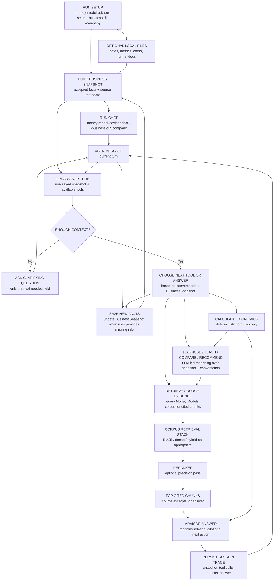

# Implementation Plan

This project should be built experiment-first.

The architecture docs describe the intended system. The implementation plan keeps the work honest: every major RAG or agent choice should either be part of the minimal runnable slice or justified by an evaluation report.

## Principle

Treat RAG architecture like ML model selection:

1. Define the candidate techniques.
2. Run them against the same evaluation set.
3. Compare quality, latency, cost, and failure modes.
4. Adopt the simplest variant that clears the decision rule.
5. Record the decision in `evals/reports/`.

The goal is not to build every sophisticated component immediately. The goal is to make each added component earn its place.

## Current product direction

The next real product slice is CLI-first with two modes:

```bash
money-model-advisor setup --business-dir /path/to/company
money-model-advisor chat --business-dir /path/to/company
```

`setup` builds the initial `BusinessSnapshot` from setup/intake and optional local files. `chat` uses the saved snapshot only. If the user provides missing information during chat, the advisor saves that fact back into the snapshot with source metadata. This keeps `BusinessSnapshot` as the cache and avoids rereading local files during every advisor turn.

The v1 advisor loop is subscription-operated through Codex/ChatGPT using local CLI tools and saved state. Active work should not require provider keys.

The v1 snapshot contract is defined in `BUSINESS_SNAPSHOT_V1.md`.

Tooling recommendations are recorded in `TOOLING_SHORTLIST.md`.

**CLI setup and advisor loop:**



In this diagram, **retrieve** means: search the Money Models source corpus for chunks that can support the advisor's answer with citations. It does not mean rereading the user's local business files, searching the web, or deciding the user's intent. The advisor may retrieve when it needs evidence to teach a concept, compare options, explain a diagnosis, or support a recommendation.

The other tools are separate:

- **Calculate economics:** run deterministic formulas such as CAC payback.
- **Update snapshot:** persist accepted business facts the user provides.
- **Answer:** compose the advisor response from the conversation, `BusinessSnapshot`, calculations, and any retrieved source chunks.

## Current baseline

Implemented:

- Local transcript corpus search with BM25-style scoring.
- Five-layer namespace taxonomy with primary and secondary chapter roles.
- Deterministic unit-economics formulas.
- Constraint diagnosis aligned to the coach diagnostic flow.
- 32-query retrieval eval in `evals/golden.jsonl`.
- Local retrieval baseline report in `evals/reports/local_retrieval_baseline.md`.
- Chunking comparison report in `evals/reports/chunking_comparison.md`.
- Reviewed required-claim support labels in `evals/obligations.jsonl`.
- Local required-claim review UI in `scripts/review_obligations.py`.
- Required-claim support scorer in `scripts/score_obligation_support.py`.
- `BusinessSnapshot v1` schema and JSON persistence in `src/money_model_architect/snapshot.py`.
- Setup/intake state directory and manifest hashing in `src/money_model_architect/business_context.py`.
- Setup/intake answer collection in `src/money_model_architect/setup_intake.py`.
- Advisor query policy in `ADVISOR_QUERY_POLICY_V1.md` and `src/money_model_architect/advisor_queries.py`.
- Advisor query execution and evidence capture in `src/money_model_architect/advisor_retrieval.py`.
- First stateful advisor turn in `src/money_model_architect/advisor.py`.
- `setup` and `chat` CLI commands. `sync` remains an alias for `setup`.
- Framework-aware chunking candidate implemented, but not adopted as default.
- Unit test for the calculator.

Run checks:

```bash
PYTHONPATH=src python3 scripts/eval_smoke.py
PYTHONPATH=src python3 scripts/eval_retrieval.py
PYTHONPATH=src python3 scripts/compare_chunking.py
PYTHONPATH=src python3 scripts/score_obligation_support.py --include-proposed
PYTHONPATH=src python3 -m money_model_architect.cli setup --business-dir /tmp/mma-demo-business
PYTHONPATH=src python3 -m money_model_architect.cli setup --business-dir /tmp/mma-demo-business --answers '{"business":{"business_type":"coaching business","icp":"gym owners"},"money_model":{"core_offer":{"description":"implementation program","price":5000},"attraction_offer":{"exists":true},"upsell":{"exists":false},"downsell":{"exists":true},"continuity":{"exists":false}},"economics":{"cac":350,"first_30_day_gross_profit":120},"problem":{"user_goal":"diagnose cash payback"}}'
PYTHONPATH=src python3 -m money_model_architect.cli chat --business-dir /tmp/mma-demo-business --message "We are a coaching business. Core offer is implementation program. CAC is $350 and first-30-day gross profit is $120. I want to diagnose cash payback."
python3 -m unittest discover -s tests -v
```

## Phase 1 — Evaluation Harness

Objective: make architecture comparisons easy to run.

Build:

- Expand `evals/golden.jsonl` from 5 records to roughly 30 records. **Done: 32 records.**
- Add retrieval metrics: hit@1, hit@5, MRR. **Done for local retrieval.**
- Write run outputs to `evals/runs/*.json`. **Done for local retrieval.**
- Add a report generator for Markdown tables. **Done for local retrieval.**

Acceptance criteria:

- A single command evaluates the current local retriever. **Done.**
- Results include per-query failures, aggregate metrics, and latency. **Done.**
- The first report can be generated without external services. **Done.**

First report:

- `evals/reports/local_retrieval_baseline.md`

## Phase 2 — Chunking Comparison

Objective: justify the chunking strategy with data.

Compare:

- Fixed-size windows. **Done for 300, 512, and 800 word variants.**
- Heading-aware transcript chunks. **Done.**
- Framework-aware chunks. **Done as a candidate.**
- Different target sizes and overlap settings. **Done for fixed-window baseline variants.**

Metrics:

- hit@5. **Done.**
- MRR. **Done.**
- average chunk tokens. **Done as average words per chunk.**

Decision rule:

Use the smallest chunking strategy that preserves framework completeness and does not regress retrieval quality beyond the configured threshold.

Current result:

- `heading-aware` wins the local BM25 comparison with Hit@1 81.25%, Hit@5 100%, and MRR 0.8917.
- Fixed windows all reached Hit@5 100%, but underperformed on Hit@1 and MRR.
- `framework-aware` slightly improves MRR to 0.8958, but does not clear the adoption rule because Hit@1 is unchanged and MRR gain is below 0.01.
- Required-claim support coverage is evaluated in Phase 3 as the support guardrail rather than during chunking selection.
- Adopted default remains `heading-aware`.

Report:

- `evals/reports/chunking_comparison.md`

## Phase 3 — Local Retrieval Guardrails

Objective: keep retrieval evaluation honest without introducing provider-key calls.

Current active checks:

- BM25 heading-aware retrieval over the local corpus. **Done.**
- Required-claim support coverage over reviewed labels. **Done.**
- Query realism audit to prevent framework-name-heavy evals from overstating quality. **Done.**

Metrics:

- hit@1, hit@5, and MRR for local retrieval. **Done.**
- required-claim support coverage. **Done.**
- lexical-overlap audit for query realism. **Done.**

Decision rule:

Keep retrieval local and simple until the advisor loop and label methodology justify more complexity. Do not add provider-key-dependent retrieval to the active build.

Current result:

- `bm25`: Hit@1 81.25%, Hit@5 100%, MRR 0.8917.
- Required-claim review status: 65 accepted labels, none needing attention.
- Accepted-label BM25 heading-aware required-claim support coverage: 87.69%, with 8 unsupported claims.
- Decision: use these as local guardrails, not final product-quality proof. The next methodology should focus on realistic advisor behavior and human/subscription-reviewed answer quality.

Report:

- `evals/reports/local_retrieval_baseline.md`
- `evals/reports/obligation_support_coverage.md`

## Phase 4 — Robust Local Evaluation Methodology

Objective: define an evaluation method that is strong enough to improve the advisor without provider-key-dependent labeling.

Build:

- Replace the pilot query set with realistic user-intent queries.
- Draft set: `evals/realistic_queries.jsonl`.
- Methodology note: `evals/reports/query_realism.md`.
- Audit script: `scripts/audit_query_realism.py`.
- Include query types: exact framework names, paraphrases, business situations, diagnostic numeric scenarios, confusable near-neighbor questions, and noisy/vague user phrasing.
- Audit queries for lexical overlap with chapter titles and framework names so BM25 is not accidentally advantaged.
- For each eval query or advisor trace, collect the retrieved chunks and final answer.
- Review retrieved chunks and answers through local review UI or subscription-operated review.
- Keep required-claim labels as answer-readiness checks, not exhaustive relevance labels.

Metrics:

- next-action correctness
- answer usefulness
- citation/support correctness
- deterministic calculation correctness
- user turns to useful recommendation

Decision rule:

Use local human/subscription-reviewed traces to decide whether the advisor is improving. Keep simple retrieval metrics as smoke checks only.

Reports:

- `evals/reports/query_realism.md`
- future `evals/reports/advisor_behavior_eval.md`

## Phase 5 — Advisor Behavior Evals

Objective: evaluate the subscription-operated advisor loop by behavior, not by provider model comparison.

Scenarios:

- missing context -> asks the next useful question
- numeric facts present -> calculates correctly
- concept question -> teaches with source evidence when needed
- sufficient snapshot -> diagnoses the binding constraint
- recommendation -> cites retrieved chunks and gives a next action

Metrics:

- next-action correctness
- calculation correctness
- support/citation correctness
- answer usefulness
- trace completeness

Decision rule:

Improve prompts, tool surfaces, and snapshot fields only when behavior evals show a concrete failure pattern.

Reports:

- `evals/reports/advisor_behavior_eval.md`

## Phase 6 — CLI Stateful Advisor Slice

Objective: build the smallest useful advisor loop around real local business context.

Build:

- `money-model-advisor setup --business-dir <path>`. **Started as `setup`; supports `--interactive` and `--answers`; `sync` remains an alias.**
- `money-model-advisor chat --business-dir <path>`. **Started as `chat`; console-script alias added.**
- A business-context manifest that records files read, hashes, parse status, and extracted snippets. **Started: hashes, size, mtime, parse status.**
- A persisted `BusinessSnapshot` stored under `.money-model-advisor/` in the target directory. **Done.**
- Snapshot update from setup answers and the user's chat message. **Started for setup answers and obvious user-message facts.**
- An LLM-led advisor turn that can clarify, calculate, diagnose, retrieve, critique, draft, compare, teach, recommend, and update saved context. **Not yet implemented as an LLM loop; current skeleton covers clarify/payback diagnosis and `advisory_status` tracks `insufficient_context`, `diagnosable`, `diagnosed`, and `recommendable`.**
- Targeted missing-field questions before diagnosis/design when the snapshot is incomplete. **Started.**
- Session trace output with tool calls, calculations, retrieved chunks, citations, and final answer. **Started: message, actions, snapshot, planned queries, retrieved evidence, answer.**

Metrics:

- business-snapshot field extraction accuracy
- advisory-status accuracy
- next-action appropriateness
- deterministic calculation correctness
- citation coverage after retrieval
- user turns to useful recommendation

Decision rule:

Keep the CLI as the primary product surface until the advisor loop is useful without a web UI.

Report:

- `evals/reports/cli_stateful_advisor.md`

## Phase 7 — Advisor Tool Surface

Objective: verify that explicit stateful tools improve correctness and eval clarity.

Compare:

- Single retrieval endpoint.
- Stateless calculate + retrieve + diagnose tools.
- Stateful advisor tools: load context, update snapshot, plan next turn, calculate, diagnose, retrieve, critique, compare, draft.

Metrics:

- business-snapshot field extraction accuracy
- advisory-status accuracy
- next-action appropriateness
- deterministic calculation correctness
- constraint-identification accuracy
- structured-output validity
- citation coverage
- tool-loop failure rate

Decision rule:

Keep a separate tool only when it improves correctness, observability, or task-specific evaluation enough to justify the extra orchestration surface.

Report:

- `evals/reports/tool_surface.md`

## Phase 8 — Model Routing

Objective: demonstrate model-switching decisions based on data.

Compare:

- Default model for all tasks.
- Cheap model for snapshot extraction and conversation-mode planning.
- Cheap judge with escalation threshold sweep.

Metrics:

- extraction accuracy
- next-action accuracy
- answer quality
- cost per successful answer
- escalation precision

Decision rule:

Route to cheaper models when quality is statistically similar and cost improves materially. Escalate only where judge confidence predicts a quality gain.

Report:

- `evals/reports/routing_decisions.md`

## Non-goals for now

- Multi-tenant auth.
- Billing.
- Kubernetes or production infra.
- Fine-tuning.
- Multi-agent planner/executor systems.

Those can be revisited after the core evaluation story is real.
