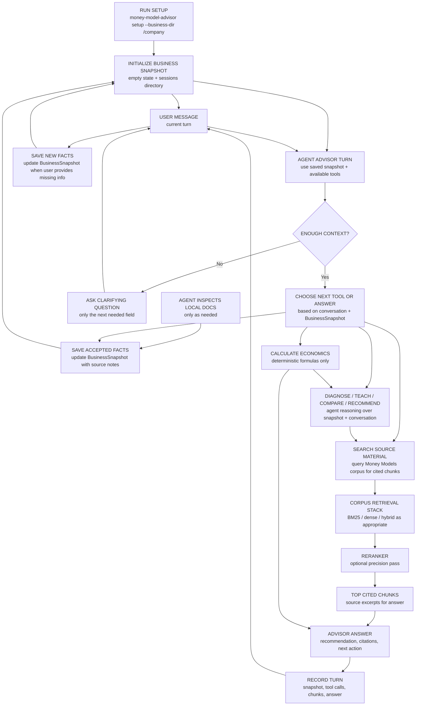

# Implementation Plan

This project should be built experiment-first.

The target job description is recorded in `JOB_DESCRIPTION.md`, the requirement-by-requirement audit is recorded in `JD_REQUIREMENTS_AUDIT.md`, repo-wide Codex guidance is recorded in `AGENTS.md`, and the golden-dataset suite is mapped in `GOLDEN_DATASET.md`. Implementation priorities should stay aligned with that hiring target: production-grade agent workflows, golden datasets, RAG tuning, cached embeddings, cost-aware design, observability, and regression detection.

The architecture docs describe the intended system. The implementation plan keeps the work honest: every major RAG or agent choice should either be part of the minimal runnable slice or justified by an evaluation report.

## Principle

Treat RAG architecture like ML model selection:

1. Define the candidate techniques.
2. Run them against the same evaluation set.
3. Compare quality, latency, cost, and failure modes.
4. Adopt the simplest variant that clears the decision rule.
5. Record the decision in `evals/reports/`.

The goal is not to build every sophisticated component immediately. The goal is to make each added component earn its place.

For this agent-operated product, semantic judgment belongs to the agent and deterministic bookkeeping belongs to the CLI. The CLI should persist state, run calculations, execute search, capture traces, validate artifact shape, and produce reports. The agent should decide tool use, generate source needs, inspect retrieved chunks, adjudicate semantic coverage, and judge answer quality. When the project needs semantic evals, record agent judgments with rationale and let the CLI score those recorded artifacts.

Refinement: deterministic code may classify numeric/accounting states after the agent has chosen the task. For example, it can compute whether CAC is recovered by first-30-day gross profit. It should not decide broad conversational intent or whether the current user turn is a teaching, diagnosis, recommendation, or source-search turn.

## JD Coverage Priority

The careful JD audit in `JD_REQUIREMENTS_AUDIT.md` should drive priority. The highest-signal immediate gap is model routing and tiering to improve unit economics while maintaining output quality. That should be treated as a first-class eval workstream, not an afterthought.

Use the existing golden suites to compare model/provider tiers on the same tasks:

- next-action/tool-use judgment
- source-need generation
- source-event and query-variant trace completion
- product-smoke advisor turns
- semantic adjudication tasks where applicable

For each model tier, record:

- pass/fail against the existing scorer
- trace completeness
- source-search false positives and misses
- source-need quality
- query-variant quality
- answer usefulness and grounding when manually or agent-adjudicated
- latency
- token usage and estimated cost when available, or a clearly labeled cost proxy when using subscription-based acting agents
- recurring failure modes

The output should be a routing recommendation, not merely a leaderboard. Example decision shape: deterministic CLI for formulas and persistence; cheaper/faster model tier for simple tool-use classification and trace formatting if it passes; stronger model tier for ambiguous source-need generation, claim-support adjudication, and product-smoke recommendation turns if the cheaper tier fails.

This is separate from embedding cost control. Cached embeddings reduce retrieval infrastructure cost; model routing reduces agent/LLM reasoning cost.

Second JD-specific gap: Pinecone namespace coverage. A single Pinecone namespace is a reasonable engineering default for this small corpus, especially with metadata filters. But the JD explicitly says "across multiple Pinecone namespaces," so the portfolio should not leave this invisible. We should either:

- implement and test a small multi-namespace Pinecone layout, or
- record a clear architecture decision explaining why v1 uses one namespace and what measured condition would justify splitting.

For JD alignment, the better proof is a small namespace experiment using the taxonomy the product already has:

- `money-models-unit-economics`
- `money-models-offers`
- `money-models-upsells`
- `money-models-downsells`
- `money-models-continuity`

Because the JD calls out multiple Pinecone namespaces, we test whether the existing Money Models layer taxonomy should become the hosted namespace layout. The comparison should be single namespace with metadata filters versus five layer namespaces, using the same golden cases, query variants, cache, and hybrid retrieval path.

The agent owns semantic namespace selection. The CLI must not infer namespaces from keywords, layer labels, or deterministic routing rules at search time. The CLI should validate the agent-selected logical namespace names, map them mechanically to physical Pinecone namespace names, execute the search, and record selected/query/cited namespaces in traces. Eval should score namespace choice separately from query generation and retrieval quality.

The experiment should record namespace names, embedding model, vector counts, upsert behavior, agent-selected namespace behavior, quality, latency, and failure modes. The decision should avoid namespace theater: use multiple namespaces because the job names that operating mode and because it tests index management, not because this tiny corpus inherently needs it. Single namespace may still win if it has comparable quality with lower operational complexity.

Status: namespace support is implemented and measured. The corrected runtime contract uses `SourceNeed.target_namespaces`; the CLI validates logical namespace names and mechanically maps them to physical Pinecone namespaces. Pinecone indexing has populated the five layer namespaces with 339 records total across 202 unique chunks. Local 30-case oracle namespace testing preserved hybrid quality but did not improve it over single/default namespace retrieval, and it increased vector search count from 120 to 140. A hosted 5-case Pinecone namespace smoke preserved hybrid quality but exposed the expected latency cost of sequential query-variant x namespace fanout. Next step is not more namespace theater; it is either agent namespace-selection evals or parallel/bounded hosted retrieval, depending on which JD gap we prioritize next.

## Current product direction

The next real product slice is agent-first and CLI-backed. A human talks to an agent, the agent follows the project skill's guidance, and the agent runs local CLI commands:

| Operation | Current CLI command |
|---|---|
| `setup_state` | `money-model-advisor setup --business-dir /path/to/company` |
| `read_snapshot` | `money-model-advisor snapshot --business-dir /path/to/company` |
| `update_snapshot` | `money-model-advisor snapshot set --business-dir /path/to/company field=value` |
| `calculate` | `money-model-advisor calculate ...` |
| `search_source_material` | `money-model-advisor search ...` |
| `turn_record` | `money-model-advisor turn record --business-dir /path/to/company ...` |
| `logs` | `money-model-advisor logs --business-dir /path/to/company` |

`setup_state` initializes local advisor state and an empty `BusinessSnapshot`. The agent inspects local business docs as needed, saves accepted facts through `update_snapshot`, uses deterministic tools for calculations and source search, composes the answer, then records the completed turn with `turn_record`. This keeps `BusinessSnapshot` as the cache and avoids rereading local files during every advisor turn.

The v1 advisor loop is operated by the agent using local CLI commands and saved state. Humans can still run the same commands directly for development, debugging, or manual control. Active work should not require external model-service keys.

The v1 snapshot contract is defined in `BUSINESS_SNAPSHOT_V1.md`.

Tooling recommendations are recorded in `TOOLING_SHORTLIST.md`.

Retrieval handoff notes are recorded in `ADVISOR_RETRIEVAL_HANDOFF.md`. That document captures the 1584 Design trace review, the critique of the current next-action classification and query-generation behavior, and the next planner-eval work.

Current dev requirement:

1. Treat the current next-action classification eval as the local baseline for tool-use judgment: for each realistic turn, should the next action be source-material search, snapshot/log read, local-doc inspection, calculation, diagnosis, clarification, saved-context update, compose-from-state, or answer-without-tool?
2. Use the source-query quality eval next: only on turns where source-material search is the right action, did the generated query retrieve useful Money Models chunks?

This keeps retrieval evaluation from punishing or rewarding queries that should never have been generated.

Progress trackers:

- `TOOL_USE_JUDGMENT_PROGRESS.md`
- `TOOL_USE_EVAL_IMPLEMENTATION_PLAN.md`
- `SOURCE_NEED_GENERATION_PROGRESS.md`
- `SEARCH_QUERY_QUALITY_PROGRESS.md`

Improvement strategy:

- Next-action classification improves through iterative skill and tool-surface testing: run realistic conversations, inspect traces, identify wrong action labels, and revise the skill instructions or CLI affordances.
- Query generation improves through a search-only eval loop: label search-appropriate turns by retrieval purpose, expected layer, and focus terms; generate compact source-seeking queries; inspect returned chunks; then compare BM25, vector, and hybrid retrieval only after query construction is sane.
- Semantic evals should use agent or human adjudication artifacts rather than hidden keyword proxies. For example, focus-term concept coverage should be judged by an agent and recorded with rationale, while exact substring recall can remain a debugging metric.

The first next-action classification pass has been captured and scored. The first source-query quality eval now has two modes: reference mode for reviewer-authored source-specific queries, and generated mode for the current runtime query builder with an explicit `SourceNeed`. The current result shows the corpus can retrieve useful chunks when the source need is explicit, and generated queries no longer reuse broad diagnostic language on the eval slice. The source-need generation eval has now been rerun with blind acting-agent traces after taxonomy guidance and focus-alias cleanup. Search/no-search decisions remain clean, intent match is 100.0%, layer exact match is 90.0%, and focus-term concept recall is 0.750. Future next-action work should revise the eval only when new behavior classes appear; the immediate active implementation work can now move toward retrieval-backend comparison, while carrying the known free-trial `offers`/`downsells` residual as a caveat.

Current boundary debt to resolve:

1. Make `SourceNeed` required for production source search; remove or archive status-driven query generation.
2. Replace deterministic product-facing `chat` with `turn_record`, so the CLI persists turns and records artifacts while the agent decides whether to calculate, search, clarify, or answer.
3. Add an eval artifact for agent-adjudicated focus-term concept coverage and retrieved-chunk usefulness.

Detailed plan: `AGENT_CLI_BOUNDARY_REFACTOR_PLAN.md`.

**CLI setup and advisor loop:**



In this diagram, **search source material** means: search the Money Models source corpus for chunks that can support the advisor's answer with citations. It does not mean rereading the user's local context files, searching the web, or deciding the user's intent. The agent may inspect local business docs before saving accepted facts, and product-facing turns use the snapshot. The advisor may search source material when it needs support to teach a concept, compare options, explain a diagnosis, or support a recommendation.

The other tools are separate:

- **Calculate economics:** run deterministic formulas such as CAC payback.
- **Update snapshot:** persist accepted business facts the user provides.
- **Answer:** compose the advisor response from the conversation, `BusinessSnapshot`, calculations, and any retrieved source chunks.

## Current baseline

Implemented:

- Local transcript corpus search with BM25-style scoring.
- Five-layer namespace taxonomy with primary and secondary chapter roles.
- Deterministic unit-economics formulas.
- Constraint diagnosis aligned to the coach diagnostic flow.
- 32-query retrieval eval in `evals/golden.jsonl`.
- Local retrieval baseline report in `evals/reports/local_retrieval_baseline.md`.
- Chunking comparison report in `evals/reports/chunking_comparison.md`.
- Reviewed required-claim support labels in `evals/obligations.jsonl`.
- Local required-claim review UI in `scripts/review_obligations.py`.
- Required-claim support scorer in `scripts/score_obligation_support.py`.
- `BusinessSnapshot v1` schema and JSON persistence in `src/money_model_architect/snapshot.py`.
- Setup/intake state directory in `src/money_model_architect/business_context.py`.
- Setup/intake answer collection in `src/money_model_architect/setup_intake.py`.
- Advisor query policy in `ADVISOR_QUERY_POLICY_V1.md` and `src/money_model_architect/advisor_queries.py`.
- Advisor query execution and evidence capture in `src/money_model_architect/advisor_retrieval.py`.
- Deterministic stateful advisor prototype removed from the active source tree.
- `setup`, `search`, `search --source-need-json`, `snapshot`, `calculate`, `diagnose`, `logs`, and `turn record` CLI commands.
- Advisor operating guide in `ADVISOR_OPERATING_GUIDE.md` and project-local skill file in `.codex/skills/money-model-advisor/SKILL.md`.
- Framework-aware chunking candidate implemented, but not adopted as default.
- Unit test for the calculator.

Current retrieval limitation:

- The session trace now records exact retrieval queries and returned chunks, but the v1 tool-choice logic and query generator are too state-triggered. Once a snapshot becomes diagnosable, later turns can repeat the same diagnostic query even when the current turn needs business-doc lookup, saved-state/provenance lookup, calculation, teaching, direct answer synthesis, or an ad-spend-specific source query. See `ADVISOR_RETRIEVAL_HANDOFF.md`.

Run checks:

```bash
PYTHONPATH=src python3 scripts/eval_smoke.py
PYTHONPATH=src python3 scripts/eval_retrieval.py
PYTHONPATH=src python3 scripts/compare_chunking.py
python3 scripts/eval_search_query_quality.py --query-source generated --retrieval-backend bm25 --report evals/reports/advisor_search_query_quality_generated_bm25.md
python3 scripts/compare_retrieval_backends.py --query-source generated --report evals/reports/retrieval_backend_comparison.md
PYTHONPATH=src python3 scripts/score_obligation_support.py --include-proposed
PYTHONPATH=src python3 -m money_model_architect.cli setup --business-dir /tmp/mma-demo-business
PYTHONPATH=src python3 -m money_model_architect.cli setup --business-dir /tmp/mma-demo-business --answers '{"business":{"business_type":"coaching business","icp":"gym owners"},"money_model":{"core_offer":{"description":"implementation program","price":5000},"attraction_offer":{"exists":true},"upsell":{"exists":false},"downsell":{"exists":true},"continuity":{"exists":false}},"economics":{"cac":350,"first_30_day_gross_profit":120},"problem":{"user_goal":"diagnose cash payback"}}'
PYTHONPATH=src python3 -m money_model_architect.cli search "CAC payback period" --layer unit-economics
PYTHONPATH=src python3 -m money_model_architect.cli snapshot --business-dir /tmp/mma-demo-business
PYTHONPATH=src python3 -m money_model_architect.cli snapshot set --business-dir /tmp/mma-demo-business economics.cac=350
PYTHONPATH=src python3 -m money_model_architect.cli logs --business-dir /tmp/mma-demo-business
python3 -m unittest discover -s tests -v
```

## Phase 1 — Evaluation Harness

Objective: make architecture comparisons easy to run.

Build:

- Expand `evals/golden.jsonl` from 5 records to roughly 30 records. **Done: 32 records.**
- Add retrieval metrics: hit@1, hit@5, MRR. **Done for local retrieval.**
- Write run outputs to `evals/runs/*.json`. **Done for local retrieval.**
- Add a report generator for Markdown tables. **Done for local retrieval.**

Acceptance criteria:

- A single command evaluates the current local retriever. **Done.**
- Results include per-query failures, aggregate metrics, and latency. **Done.**
- The first report can be generated without external services. **Done.**
- A backend comparison command evaluates BM25, vector, and hybrid over stable generated-query cases. **Done; vector and hybrid require uncached embeddings or an existing embedding cache.**

First report:

- `evals/reports/local_retrieval_baseline.md`
- `evals/reports/retrieval_backend_comparison.md`

Embedding policy:

- OpenAI embeddings may be used for deterministic vectorization only. They are not used for source-need generation, labeling, planning, answer synthesis, or acting-agent evaluation.
- Embeddings are cached by exact input text and model under `.cache/embeddings/`. This demonstrates the production cost-control pattern the advisor would use: pay once for stable corpus vectors, reuse cached vectors on later runs, and only create new query vectors when the agent asks a new search question.

First generated-query backend result:

- Plain generated BM25: 93.3% known-useful Hit@3, 100.0% Hit@5, mean known-useful rank 1.43.
- Plain generated vector: 96.7% known-useful Hit@3/Hit@5, mean known-useful rank 1.34, misses `searchq_v1_001`.
- Plain generated hybrid: 96.7% known-useful Hit@3/Hit@5, mean known-useful rank 1.21, misses `searchq_v1_001`.
- Generated variants + hybrid: 100.0% known-useful Hit@3/Hit@5, mean known-useful rank 1.17, no top-5 misses.

Decision: BM25 remains the lexical baseline/control for citation-oriented source lookup. It is not the intended product architecture for the hiring narrative. The target product path is hybrid retrieval with constrained query variants, cached embeddings, eval-gated promotion, and a Pinecone-backed vector store behind a clean storage boundary. The 30-case expanded slice plus Pinecone parity supports moving hybrid+variants to candidate default, while requiring continued golden-set expansion and hosted-vector latency optimization before calling it production-final.

JD-aligned next experiment:

- Formalize the existing eval files as a golden-dataset suite. **Done in `GOLDEN_DATASET.md`.**
- Add agent-generated query variants under a constrained schema. **Done in `SourceNeed.query_variants` and `evals/advisor_query_variants_v2.jsonl`.**
- Keep the deterministic flattened query as a fallback variant. **Done.**
- Fuse variant-level retrieval results so repeated chunks across variants are promoted instead of allowing early variants to crowd out the fallback. **Done in the query-quality scorer.**
- Compare v1 flattened queries versus v2 variants on the golden search-query cases. **Done in `evals/reports/retrieval_backend_comparison_generated_variants.md`.**
- Record quality, latency, embedding-cache behavior, and cost-oriented signals in the report. **Done in the backend comparison reports, summary JSON, and case JSONL artifacts.**

Detailed implementation plan for the next report pass:

1. Add embedding instrumentation without changing retrieval behavior.

   Extend `OpenAIEmbeddingClient` with a small stats object that records cache hits, cache misses, API batches, embedded inputs, embedding model, cache namespace, and approximate input characters. Keep the cache key and embedding outputs unchanged. Cache keys must continue to include the embedding model and exact input text. Tag each embedding event by purpose, at minimum `corpus` versus `query`, so one-time corpus indexing cost does not get mixed into per-query cost. The goal is observability, not a retrieval change.

2. Add per-backend timing in the search-query evaluator.

   Measure index-build time once per backend run and per-case timing around the actual work. Where the code can separate phases cleanly, record `query_build_ms`, `embedding_ms`, `retrieval_ms`, `merge_rank_ms`, and `total_ms`. Report p50 and p95 latency for BM25, vector, and hybrid. Keep quality metrics identical so the new report answers: did the same retrieval choice improve quality, and what did it cost in runtime?

3. Add cache/cost reporting to backend comparison.

   For vector and hybrid runs, include corpus embedding cache hits/misses, query embedding cache hits/misses, cache hit rate, API requests/batches, estimated newly embedded inputs, estimated embedding input characters or tokens, estimated incremental embedding cost, and estimated cost per 1,000 queries. BM25 should report zero embedding requests and zero embedding cost. Cost estimates should be clearly labeled as estimates and based on configured model pricing constants, not treated as billing truth.

   Query-variant reporting must include `variant_count`, `vector_search_count`, `embedding_inputs_by_variant`, and merged-result count. This prevents query variants from quietly buying recall with extra latency or cost.

4. Emit machine-readable run artifacts.

   In addition to Markdown reports, write a summary JSON artifact with aggregate metrics by backend and a case-level JSONL artifact with one row per case per backend. Default filenames should mirror the Markdown report stem, for example `retrieval_backend_comparison_summary.json`, `retrieval_backend_comparison_cases.jsonl`, `retrieval_backend_comparison_generated_variants_summary.json`, and `retrieval_backend_comparison_generated_variants_cases.jsonl`. Include case id, backend, query source, query count, variant count, vector search count, top chunk ids, rank, hit flags, latency fields, cache counters, and estimated cost. These artifacts should be stable enough to diff across runs.

5. Separate warm-cache and cold-cache interpretation.

   The default report should describe the current cache state because that is what a developer run actually experienced. Include `cache_mode`, `cache_namespace`, `embedding_cache_dir`, and whether the cache was already complete for the query embeddings before each backend run. Add an optional cold-cache mode or documented manual command later only if needed. Do not delete `.cache/embeddings/` during ordinary eval runs; that would make routine testing unnecessarily expensive and fragile.

   If cold-cache and warm-cache runs are added, report them separately. Do not blend the numbers: cold-cache tells us first-run embedding cost, while warm-cache tells us steady-state developer/product behavior.

   Do not let hybrid appear cheaper simply because vector warmed query embeddings earlier in the same comparison. Reset stats per backend while intentionally sharing the cache, and report both external embedding calls made by that backend and cache entries already available before that backend ran.

6. Preserve the current product boundary.

   Embedding API use remains allowed only for deterministic vectorization. Do not add external model calls for source-need generation, labeling, acting-agent traces, or answer synthesis. This keeps the JD-aligned cost story focused: cached embeddings reduce vector retrieval cost, while agent reasoning stays in the Codex/subscription path.

7. Update reports and docs together.

   Regenerate `evals/reports/retrieval_backend_comparison.md` and `evals/reports/retrieval_backend_comparison_generated_variants.md`, then update the report docs and `SEARCH_QUERY_QUALITY_PROGRESS.md` with the observed quality/latency/cache/cost tradeoff. Update `DESIGN.md`, `GOLDEN_DATASET.md`, or `JOB_DESCRIPTION.md` only if the observed results materially change the architecture, golden-dataset map, or JD-positioning story.

Acceptance criteria:

- Backend comparison reports include the existing quality table plus a performance/cost table.
- Reports show p50/p95 retrieval latency for every backend.
- Reports separate corpus embedding cache behavior from query embedding cache behavior.
- Reports show embedding cache hits, misses, hit rate, API batches, estimated incremental embedding cost, and estimated cost per 1,000 queries for vector/hybrid.
- Reports do not hide query-variant cost: query count, variant count, vector search count, and embedding inputs by variant are visible.
- A summary JSON artifact and case-level JSONL artifact are written for each comparison run.
- BM25 reports zero embedding requests and zero embedding cost.
- Warm-cache runs make zero external embedding calls when all corpus and query embeddings are cached.
- Unit tests cover cache-hit/cache-miss accounting without making network calls.
- Existing retrieval-quality numbers do not change; latency may vary.
- The narrative explicitly says cached embeddings are the cost-control mechanism and does not imply that agent work uses the OpenAI API.
- Latency tests do not hard-fail on exact milliseconds; any thresholds should be broad budgets, not brittle stopwatch assertions.

Observed result:

- Plain generated query comparison preserved the previous quality result: BM25 reaches 100.0% Hit@5; vector and hybrid each miss `searchq_v1_001` at Hit@5.
- Generated variants preserved the previous quality result: hybrid reaches 100.0% Hit@3/Hit@5 with mean known-useful rank 1.17.
- Generated variants expose the operational cost of that quality improvement: average query count rises from 1.0 to 4.0 and vector/hybrid vector searches rise from 30 to 120 on the 30-case slice.
- Warm-cache runs made zero external embedding API calls because corpus and query embeddings were already cached. The report separates corpus and query cache behavior so this is not confused with cold-cache cost.
- Machine-readable artifacts are now emitted beside the Markdown reports: `retrieval_backend_comparison_summary.json`, `retrieval_backend_comparison_cases.jsonl`, `retrieval_backend_comparison_generated_variants_summary.json`, and `retrieval_backend_comparison_generated_variants_cases.jsonl`.

## Phase 2 — Chunking Comparison

Objective: justify the chunking strategy with data.

Compare:

- Fixed-size windows. **Done for 300, 512, and 800 word variants.**
- Heading-aware transcript chunks. **Done.**
- Framework-aware chunks. **Done as a candidate.**
- Different target sizes and overlap settings. **Done for fixed-window baseline variants.**

Metrics:

- hit@5. **Done.**
- MRR. **Done.**
- average chunk tokens. **Done as average words per chunk.**

Decision rule:

Use the smallest chunking strategy that preserves framework completeness and does not regress retrieval quality beyond the configured threshold.

Current result:

- `heading-aware` wins the local BM25 comparison with Hit@1 81.25%, Hit@5 100%, and MRR 0.8917.
- Fixed windows all reached Hit@5 100%, but underperformed on Hit@1 and MRR.
- `framework-aware` slightly improves MRR to 0.8958, but does not clear the adoption rule because Hit@1 is unchanged and MRR gain is below 0.01.
- Required-claim support coverage is evaluated in Phase 3 as the support guardrail rather than during chunking selection.
- Adopted default remains `heading-aware`.

Report:

- `evals/reports/chunking_comparison.md`

## Phase 3 — Local Retrieval Guardrails

Objective: keep retrieval evaluation honest without introducing external model-service calls.

Current active checks:

- BM25 heading-aware retrieval over the local corpus. **Done.**
- Required-claim support coverage over reviewed labels. **Done.**
- Query realism audit to prevent framework-name-heavy evals from overstating quality. **Done.**

Metrics:

- hit@1, hit@5, and MRR for local retrieval. **Done.**
- required-claim support coverage. **Done.**
- lexical-overlap audit for query realism. **Done.**

Decision rule:

Use local retrieval as the fast guardrail and baseline. Hosted retrieval should be added only behind the same retrieval storage boundary, so evals can compare local and Pinecone-backed behavior without rewriting advisor logic.

Current result:

- `bm25`: Hit@1 81.25%, Hit@5 100%, MRR 0.8917.
- Required-claim review status: 65 accepted labels, none needing attention.
- Accepted-label BM25 heading-aware required-claim support coverage: 87.69%, with 8 unsupported claims.
- Decision: use these as local guardrails, not final product-quality proof. The next methodology should focus on realistic advisor behavior and human/subscription-reviewed answer quality.

Report:

- `evals/reports/local_retrieval_baseline.md`
- `evals/reports/obligation_support_coverage.md`

## Phase 3B — Pinecone Vector Store Adapter

Objective: make the retrieval layer credible for a hosted product while preserving fast local evals.

Narrative:

"I started with local retrieval so I could iterate quickly and build reliable evals. Once the retrieval strategy was justified, I added a Pinecone-backed vector store behind the same interface, so the system could move from local CLI experimentation to hosted production retrieval without rewriting advisor logic."

Implementation framing:

The important decision is the vector-store boundary, not the adapter's internal transport. The first Pinecone implementation uses a small direct HTTP wrapper so the advisor, eval harness, and future web surface depend only on a narrow `VectorStore` contract instead of Pinecone-specific SDK objects. In production, the adapter internals could be swapped to the official SDK if that improved retries, auth ergonomics, batching, observability, or maintenance; the retrieval contract, tests, and narrative would stay the same.

Design:

- Define a `VectorStore` boundary responsible for vector upsert and vector query, not answer synthesis or source-need generation.
- Keep current local in-memory vector search as `LocalVectorStore` or equivalent for fast tests and eval iteration.
- Add `PineconeVectorStore` as the first hosted implementation.
- Keep BM25 lexical search local; hybrid retrieval should fuse BM25 results with whichever vector store is selected.
- Keep embedding generation and cache behavior separate from vector storage. The vector store stores/query vectors; the embedding client creates vectors and records cache/cost metrics.
- Use environment/config selection such as `MMA_VECTOR_STORE=local|pinecone`.
- Required Pinecone metadata per chunk: `chunk_id`, `chapter`, `layer`, `layers`, `char_start`, `char_end`, `embedding_model`, `chunking_strategy`, `content_hash`, and enough text or text reference to support citation rendering.
- Use stable vector ids such as `{chunking_strategy}:{embedding_model}:{chunk_id}` so re-indexing is idempotent.

Build order:

1. Add the `VectorStore` protocol and local implementation without changing retrieval quality. **Done.**
2. Move current in-memory vector search through that boundary. **Done.**
3. Add Pinecone config and client wrapper. **Done.**
4. Add an indexing command that upserts heading-aware corpus chunks to Pinecone with metadata. **Done.**
5. Add a Pinecone-backed vector search path and keep hybrid fusion unchanged above it. **Done.**
6. Extend backend comparison so vector/hybrid can run against local or Pinecone vector storage. **Done.**
7. Run the same golden search-query evals against local and Pinecone and record parity, latency, cache behavior, and cost. **Done for generated-variants slice.**

Acceptance criteria:

- Existing local retrieval tests still pass.
- Local vector/hybrid quality is unchanged after the adapter boundary is introduced.
- Pinecone indexing is idempotent for the current corpus/chunking/embedding-model combination.
- Pinecone vector search returns chunk ids that map back to the same local chunk records used for citations.
- Backend comparison can report whether vector storage is `local` or `pinecone`.
- Pinecone-backed evals use the same 30-case golden search-query slice and do not require changing labels.
- Docs clearly explain that CLI and future web UI share the same core retrieval/eval logic.

Non-goals:

- Do not move BM25 into Pinecone.
- Do not make Pinecone required for local tests.
- Do not add web UI in the same implementation pass; the adapter prepares the core for a hosted surface.

Current status:

- `src/money_model_architect/vector_store.py` defines `VectorStore`, `LocalVectorStore`, and `PineconeVectorStore`.
- `CorpusIndex.vector_search` now routes vector retrieval through the selected vector store.
- `search --vector-store local|pinecone` and backend comparison `--vector-store local|pinecone` are implemented.
- `index pinecone` upserts heading-aware corpus chunk vectors to Pinecone using stable ids and chunk metadata.
- Local adapter parity is verified: generated and generated-variants reports preserve the previous quality results through `--vector-store local`.
- Pinecone index `money-models-advisor` is configured locally and contains 202 heading-aware chunk vectors.
- Pinecone parity is verified on the 30-case generated-variants slice: hybrid+variants reaches 100.0% Hit@3, 100.0% Hit@5, mean known-useful rank 1.17, and no top-5 misses.
- Pinecone eval cost was controlled by cached embeddings: 100.0% query cache hit rate and zero external embedding API batches during the comparison run.
- Pinecone hosted-vector latency is the next optimization target: the current sequential variant eval produced 120 Pinecone vector searches and roughly 5.3s p50 retrieval latency for hybrid in this harness.

## Phase 4 — Robust Local Evaluation Methodology

Objective: define an evaluation method that is strong enough to improve the advisor without external-service-dependent labeling.

Build:

- Replace the pilot query set with realistic user-intent queries.
- Draft set: `evals/realistic_queries.jsonl`.
- Methodology note: `evals/reports/query_realism.md`.
- Audit script: `scripts/audit_query_realism.py`.
- Include query types: exact framework names, paraphrases, business situations, diagnostic numeric scenarios, confusable near-neighbor questions, and noisy/vague user phrasing.
- Audit queries for lexical overlap with chapter titles and framework names so BM25 is not accidentally advantaged.
- For each eval query or advisor trace, collect the retrieved chunks and final answer.
- Review retrieved chunks and answers through local review UI or agent-assisted human review.
- Keep required-claim labels as answer-readiness checks, not exhaustive relevance labels.

Metrics:

- next-action correctness
- answer usefulness
- citation/support correctness
- deterministic calculation correctness
- user turns to useful recommendation

Decision rule:

Use local human/subscription-reviewed traces to decide whether the advisor is improving. Keep simple retrieval metrics as smoke checks only.

Reports:

- `evals/reports/query_realism.md`
- `evals/reports/advisor_tool_use_judgment.md`
- `evals/reports/advisor_search_query_quality.md`

## Phase 5 — Advisor Behavior Evals

Objective: evaluate next-action classification and source-search query quality by behavior, not by model-service comparison.

Scenarios:

- missing context -> asks the next useful question
- numeric facts present -> calculates correctly
- concept question -> teaches with source evidence when needed
- sufficient snapshot -> diagnoses the binding constraint
- recommendation -> cites retrieved chunks and gives a next action

Metrics:

- next-action classification correctness
- source-search query quality on search-appropriate turns
- next-action correctness
- calculation correctness
- support/citation correctness
- answer usefulness
- trace completeness

Decision rule:

Improve prompts, tool surfaces, and snapshot fields only when behavior evals show a concrete failure pattern.

Reports:

- `evals/reports/local_retrieval_baseline.md`
- `evals/reports/chunking_comparison.md`
- `evals/reports/advisor_tool_use_judgment.md`
- `evals/reports/advisor_search_query_quality.md`

## Phase 6 — CLI Stateful Advisor Slice

Objective: build the smallest useful advisor loop around real local business context.

Canonical design: `CLI_DESIGN.md`.

Build:

- `money-model-advisor setup --business-dir <path>`. **Started as `setup`; supports `--interactive` and `--answers`.**
- `money-model-advisor session start --business-dir <path>`. **Done: prepares an agent workbench with snapshot summary, known/missing facts, recent traces, available operations, and trace requirements.**
- `money-model-advisor session finish --business-dir <path> --record-json <json-or-path>`. **Done: validates and persists a completed agent turn from one structured artifact.**
- `money-model-advisor turn record --business-dir <path>`. **Done: persists completed agent-operated turns.**
- `money-model-advisor search`. **Done: returns citation-ready local Money Models source chunks.**
- `money-model-advisor search --source-need-json`. **Done: source-need-driven product search.**
- `money-model-advisor snapshot` and `snapshot set`. **Done: show/update saved `BusinessSnapshot`.**
- `money-model-advisor logs`. **Done: show saved advisor session turns.**
- Advisor operating guide / project-local skill. **Done.**
- Agent-led local doc inspection before snapshot updates. **Documented in the skill; not a CLI crawler.**
- A persisted `BusinessSnapshot` stored under `.money-model-advisor/` in the target directory. **Done.**
- Snapshot update from setup answers and agent-saved facts. **Started for setup answers and `snapshot set`.**
- An agent-led advisor turn that can clarify, calculate, diagnose, search source material, critique, draft, compare, teach, recommend, and update saved context. **Target: agent loop outside deterministic CLI orchestration; CLI records and executes tools.**
- Targeted missing-field questions before diagnosis/design when the snapshot is incomplete. **Started.**
- Visible answer synthesis from snapshot, deterministic math, retrieved source chunks, and next action. **Agent-owned; deterministic `chat` synthesis has been removed from the active product path.**
- Session trace output with tool calls, calculations, retrieved chunks, citations, and final answer. **Implemented through `session start` and `session finish`; `session finish` now validates `source_events`, citations, and `calculation_events`.**
- Agent-facing end-of-turn recording. **Done: `session finish --record-json` validates trace shape and keeps `turn record` as the lower-level primitive.**
- Acting-agent CLI behavior pass. **Retested after path hardening: a realistic 1584 offer-sequencing turn completed through `session start` -> source searches -> `session finish`, with the correct `business_dir` and three recorded source events. The run exposed two follow-up fixes: require agent-generated query variants in source searches, and make `diagnose --business-dir` read saved advisor state directly. Both are now implemented. Next pass should check whether multiple acting agents use the hardened flow correctly without intervention.**
- Acting-agent test-fix loop. **Active. Latest pass hardened calculation traceability: `session finish` requires `calculation_events` when `actions` includes `calculate`, unit coverage verifies valid/missing calculation events, and five blind subagent runs passed through `evals/runs/calculation_trace/subagent_v1/` with `scripts/eval_calculation_trace_events.py`.**
- Post-hardening acting-agent regression for source-event behavior. **Expanded to six blind cases covering multi-search, pure diagnosis, pure recommendation, missing-context no-search, teaching-only, and continuity recommendation turns. Current strict report: 100.0% case pass rate, 6 / 6 expected source events matched, 0 extra-event warnings, and required agent-written `query_variants` under `evals/runs/source_events/query_variants_v1/`.**
- Product-smoke multi-turn testing. **Run v1 complete: three realistic advisor sessions are recorded under `evals/runs/product_smoke/v1/` and summarized in `evals/reports/advisor_product_smoke_v1.md`. The advisor was directionally useful, but the top modeling correction is restraint: do not add a bespoke data structure for 1584's proposed STR Design Diagnostic. Treat it as a business-specific candidate `attraction_offer` / front-end offer. The stale payback fixture is corrected; next inspect recommendation retrieval before considering any generic offer-slot economics fields.**

Metrics:

- business-snapshot field extraction accuracy
- advisory-status accuracy
- next-action appropriateness
- deterministic calculation correctness
- citation coverage after retrieval
- multi-source source-event correctness when one answer needs multiple retrieval jobs
- user turns to useful recommendation

Decision rule:

Keep the CLI as the primary product surface until the advisor loop is useful without a web UI.

Report:

- `evals/reports/cli_stateful_advisor.md`

## Phase 7 — Advisor Tool Surface

Objective: verify that explicit stateful tools improve correctness and eval clarity.

Compare:

- Single retrieval endpoint.
- Stateless calculate + retrieve + diagnose tools.
- Stateful advisor tools: load context, update snapshot, plan next turn, calculate, diagnose, retrieve, critique, compare, draft.

Metrics:

- business-snapshot field extraction accuracy
- advisory-status accuracy
- next-action appropriateness
- deterministic calculation correctness
- constraint-identification accuracy
- structured-output validity
- citation coverage
- tool-loop failure rate

Decision rule:

Keep a separate tool only when it improves correctness, observability, or task-specific evaluation enough to justify the extra orchestration surface.

Report:

- `evals/reports/tool_surface.md`

## Phase 8 — Local Advisor Quality Gate

Objective: decide whether the agent-operated advisor loop is useful enough to move beyond the CLI.

Compare:

- Agent-run workflow with explicit `SourceNeed` search and `turn record`.
- Agent-run workflow plus focus-term semantic adjudication.
- Agent-run workflow plus retrieved-chunk usefulness adjudication.

Metrics:

- next-action correctness
- answer usefulness
- citation/support correctness
- deterministic calculation correctness
- saved-fact correctness
- trace completeness

Decision rule:

Do not add a web UI, orchestration framework, or richer retrieval stack until the local advisor loop produces useful, cited, auditable answers on realistic scenarios.

Report:

- `evals/reports/advisor_quality_gate.md`

## Non-goals for now

- Multi-tenant auth.
- Billing.
- Kubernetes or production infra.
- Fine-tuning.
- Multi-agent planner/executor systems.

Those can be revisited after the core evaluation story is real.
