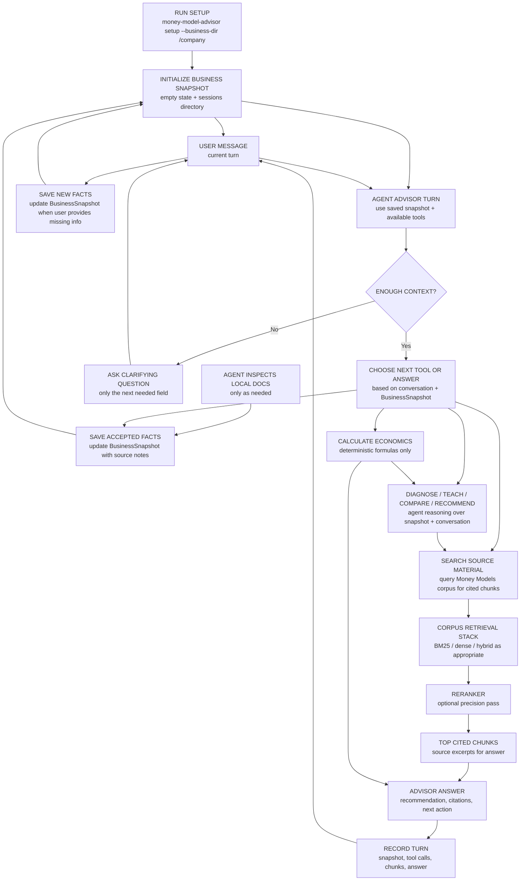

# Implementation Plan

This project should be built experiment-first.

The architecture docs describe the intended system. The implementation plan keeps the work honest: every major RAG or agent choice should either be part of the minimal runnable slice or justified by an evaluation report.

## Principle

Treat RAG architecture like ML model selection:

1. Define the candidate techniques.
2. Run them against the same evaluation set.
3. Compare quality, latency, cost, and failure modes.
4. Adopt the simplest variant that clears the decision rule.
5. Record the decision in `evals/reports/`.

The goal is not to build every sophisticated component immediately. The goal is to make each added component earn its place.

For this agent-operated product, semantic judgment belongs to the agent and deterministic bookkeeping belongs to the CLI. The CLI should persist state, run calculations, execute search, capture traces, validate artifact shape, and produce reports. The agent should decide tool use, generate source needs, inspect retrieved chunks, adjudicate semantic coverage, and judge answer quality. When the project needs semantic evals, record agent judgments with rationale and let the CLI score those recorded artifacts.

Refinement: deterministic code may classify numeric/accounting states after the agent has chosen the task. For example, it can compute whether CAC is recovered by first-30-day gross profit. It should not decide broad conversational intent or whether the current user turn is a teaching, diagnosis, recommendation, or source-search turn.

## Current product direction

The next real product slice is agent-first and CLI-backed. A human talks to an agent, the agent follows the project skill's guidance, and the agent runs local CLI commands:

| Operation | Current CLI command |
|---|---|
| `setup_state` | `money-model-advisor setup --business-dir /path/to/company` |
| `read_snapshot` | `money-model-advisor snapshot --business-dir /path/to/company` |
| `update_snapshot` | `money-model-advisor snapshot set --business-dir /path/to/company field=value` |
| `calculate` | `money-model-advisor calculate ...` |
| `search_source_material` | `money-model-advisor search ...` |
| `turn_record` | `money-model-advisor turn record --business-dir /path/to/company ...` |
| `logs` | `money-model-advisor logs --business-dir /path/to/company` |

`setup_state` initializes local advisor state and an empty `BusinessSnapshot`. The agent inspects local business docs as needed, saves accepted facts through `update_snapshot`, uses deterministic tools for calculations and source search, composes the answer, then records the completed turn with `turn_record`. This keeps `BusinessSnapshot` as the cache and avoids rereading local files during every advisor turn.

The v1 advisor loop is operated by the agent using local CLI commands and saved state. Humans can still run the same commands directly for development, debugging, or manual control. Active work should not require external model-service keys.

The v1 snapshot contract is defined in `BUSINESS_SNAPSHOT_V1.md`.

Tooling recommendations are recorded in `TOOLING_SHORTLIST.md`.

Retrieval handoff notes are recorded in `ADVISOR_RETRIEVAL_HANDOFF.md`. That document captures the 1584 Design trace review, the critique of the current next-action classification and query-generation behavior, and the next planner-eval work.

Current dev requirement:

1. Treat the current next-action classification eval as the local baseline for tool-use judgment: for each realistic turn, should the next action be source-material search, snapshot/log read, local-doc inspection, calculation, diagnosis, clarification, saved-context update, compose-from-state, or answer-without-tool?
2. Use the source-query quality eval next: only on turns where source-material search is the right action, did the generated query retrieve useful Money Models chunks?

This keeps retrieval evaluation from punishing or rewarding queries that should never have been generated.

Progress trackers:

- `TOOL_USE_JUDGMENT_PROGRESS.md`
- `TOOL_USE_EVAL_IMPLEMENTATION_PLAN.md`
- `SOURCE_NEED_GENERATION_PROGRESS.md`
- `SEARCH_QUERY_QUALITY_PROGRESS.md`

Improvement strategy:

- Next-action classification improves through iterative skill and tool-surface testing: run realistic conversations, inspect traces, identify wrong action labels, and revise the skill instructions or CLI affordances.
- Query generation improves through a search-only eval loop: label search-appropriate turns by retrieval purpose, expected layer, and focus terms; generate compact source-seeking queries; inspect returned chunks; then compare BM25, dense, and hybrid retrieval only after query construction is sane.
- Semantic evals should use agent or human adjudication artifacts rather than hidden keyword proxies. For example, focus-term concept coverage should be judged by an agent and recorded with rationale, while exact substring recall can remain a debugging metric.

The first next-action classification pass has been captured and scored. The first source-query quality eval now has two modes: reference mode for reviewer-authored source-specific queries, and generated mode for the current runtime query builder with an explicit `SourceNeed`. The current result shows the corpus can retrieve useful chunks when the source need is explicit, and generated queries no longer reuse broad diagnostic language on the seed set. The source-need generation eval has now been run with blind acting-agent traces. Search/no-search decisions are clean on the seed set, but source-need precision is only partial: intent match is 80.0%, layer exact match is 70.0%, and exact focus-term recall is low. Future next-action work should revise the eval only when new behavior classes appear; the immediate active implementation work is tightening source-need taxonomy and adding agent-adjudicated semantic coverage before retrieval-backend comparisons.

Current boundary debt to resolve:

1. Make `SourceNeed` required for production source search; remove or archive status-driven query generation.
2. Replace deterministic product-facing `chat` with `turn_record`, so the CLI persists turns and records artifacts while the agent decides whether to calculate, search, clarify, or answer.
3. Add an eval artifact for agent-adjudicated focus-term concept coverage and retrieved-chunk usefulness.

Detailed plan: `AGENT_CLI_BOUNDARY_REFACTOR_PLAN.md`.

**CLI setup and advisor loop:**



In this diagram, **search source material** means: search the Money Models source corpus for chunks that can support the advisor's answer with citations. It does not mean rereading the user's local context files, searching the web, or deciding the user's intent. The agent may inspect local business docs before saving accepted facts, and product-facing turns use the snapshot. The advisor may search source material when it needs support to teach a concept, compare options, explain a diagnosis, or support a recommendation.

The other tools are separate:

- **Calculate economics:** run deterministic formulas such as CAC payback.
- **Update snapshot:** persist accepted business facts the user provides.
- **Answer:** compose the advisor response from the conversation, `BusinessSnapshot`, calculations, and any retrieved source chunks.

## Current baseline

Implemented:

- Local transcript corpus search with BM25-style scoring.
- Five-layer namespace taxonomy with primary and secondary chapter roles.
- Deterministic unit-economics formulas.
- Constraint diagnosis aligned to the coach diagnostic flow.
- 32-query retrieval eval in `evals/golden.jsonl`.
- Local retrieval baseline report in `evals/reports/local_retrieval_baseline.md`.
- Chunking comparison report in `evals/reports/chunking_comparison.md`.
- Reviewed required-claim support labels in `evals/obligations.jsonl`.
- Local required-claim review UI in `scripts/review_obligations.py`.
- Required-claim support scorer in `scripts/score_obligation_support.py`.
- `BusinessSnapshot v1` schema and JSON persistence in `src/money_model_architect/snapshot.py`.
- Setup/intake state directory in `src/money_model_architect/business_context.py`.
- Setup/intake answer collection in `src/money_model_architect/setup_intake.py`.
- Advisor query policy in `ADVISOR_QUERY_POLICY_V1.md` and `src/money_model_architect/advisor_queries.py`.
- Advisor query execution and evidence capture in `src/money_model_architect/advisor_retrieval.py`.
- Deterministic stateful advisor prototype removed from the active source tree.
- `setup`, `search`, `search --source-need-json`, `snapshot`, `calculate`, `diagnose`, `logs`, and `turn record` CLI commands.
- Advisor operating guide in `ADVISOR_OPERATING_GUIDE.md` and project-local skill file in `.codex/skills/money-model-advisor/SKILL.md`.
- Framework-aware chunking candidate implemented, but not adopted as default.
- Unit test for the calculator.

Current retrieval limitation:

- The session trace now records exact retrieval queries and returned chunks, but the v1 tool-choice logic and query generator are too state-triggered. Once a snapshot becomes diagnosable, later turns can repeat the same diagnostic query even when the current turn needs business-doc lookup, saved-state/provenance lookup, calculation, teaching, direct answer synthesis, or an ad-spend-specific source query. See `ADVISOR_RETRIEVAL_HANDOFF.md`.

Run checks:

```bash
PYTHONPATH=src python3 scripts/eval_smoke.py
PYTHONPATH=src python3 scripts/eval_retrieval.py
PYTHONPATH=src python3 scripts/compare_chunking.py
PYTHONPATH=src python3 scripts/score_obligation_support.py --include-proposed
PYTHONPATH=src python3 -m money_model_architect.cli setup --business-dir /tmp/mma-demo-business
PYTHONPATH=src python3 -m money_model_architect.cli setup --business-dir /tmp/mma-demo-business --answers '{"business":{"business_type":"coaching business","icp":"gym owners"},"money_model":{"core_offer":{"description":"implementation program","price":5000},"attraction_offer":{"exists":true},"upsell":{"exists":false},"downsell":{"exists":true},"continuity":{"exists":false}},"economics":{"cac":350,"first_30_day_gross_profit":120},"problem":{"user_goal":"diagnose cash payback"}}'
PYTHONPATH=src python3 -m money_model_architect.cli search "CAC payback period" --layer unit-economics
PYTHONPATH=src python3 -m money_model_architect.cli snapshot --business-dir /tmp/mma-demo-business
PYTHONPATH=src python3 -m money_model_architect.cli snapshot set --business-dir /tmp/mma-demo-business economics.cac=350
PYTHONPATH=src python3 -m money_model_architect.cli logs --business-dir /tmp/mma-demo-business
python3 -m unittest discover -s tests -v
```

## Phase 1 — Evaluation Harness

Objective: make architecture comparisons easy to run.

Build:

- Expand `evals/golden.jsonl` from 5 records to roughly 30 records. **Done: 32 records.**
- Add retrieval metrics: hit@1, hit@5, MRR. **Done for local retrieval.**
- Write run outputs to `evals/runs/*.json`. **Done for local retrieval.**
- Add a report generator for Markdown tables. **Done for local retrieval.**

Acceptance criteria:

- A single command evaluates the current local retriever. **Done.**
- Results include per-query failures, aggregate metrics, and latency. **Done.**
- The first report can be generated without external services. **Done.**

First report:

- `evals/reports/local_retrieval_baseline.md`

## Phase 2 — Chunking Comparison

Objective: justify the chunking strategy with data.

Compare:

- Fixed-size windows. **Done for 300, 512, and 800 word variants.**
- Heading-aware transcript chunks. **Done.**
- Framework-aware chunks. **Done as a candidate.**
- Different target sizes and overlap settings. **Done for fixed-window baseline variants.**

Metrics:

- hit@5. **Done.**
- MRR. **Done.**
- average chunk tokens. **Done as average words per chunk.**

Decision rule:

Use the smallest chunking strategy that preserves framework completeness and does not regress retrieval quality beyond the configured threshold.

Current result:

- `heading-aware` wins the local BM25 comparison with Hit@1 81.25%, Hit@5 100%, and MRR 0.8917.
- Fixed windows all reached Hit@5 100%, but underperformed on Hit@1 and MRR.
- `framework-aware` slightly improves MRR to 0.8958, but does not clear the adoption rule because Hit@1 is unchanged and MRR gain is below 0.01.
- Required-claim support coverage is evaluated in Phase 3 as the support guardrail rather than during chunking selection.
- Adopted default remains `heading-aware`.

Report:

- `evals/reports/chunking_comparison.md`

## Phase 3 — Local Retrieval Guardrails

Objective: keep retrieval evaluation honest without introducing external model-service calls.

Current active checks:

- BM25 heading-aware retrieval over the local corpus. **Done.**
- Required-claim support coverage over reviewed labels. **Done.**
- Query realism audit to prevent framework-name-heavy evals from overstating quality. **Done.**

Metrics:

- hit@1, hit@5, and MRR for local retrieval. **Done.**
- required-claim support coverage. **Done.**
- lexical-overlap audit for query realism. **Done.**

Decision rule:

Keep retrieval local and simple until the advisor loop and label methodology justify more complexity. Do not add external-service-dependent retrieval to the active build.

Current result:

- `bm25`: Hit@1 81.25%, Hit@5 100%, MRR 0.8917.
- Required-claim review status: 65 accepted labels, none needing attention.
- Accepted-label BM25 heading-aware required-claim support coverage: 87.69%, with 8 unsupported claims.
- Decision: use these as local guardrails, not final product-quality proof. The next methodology should focus on realistic advisor behavior and human/subscription-reviewed answer quality.

Report:

- `evals/reports/local_retrieval_baseline.md`
- `evals/reports/obligation_support_coverage.md`

## Phase 4 — Robust Local Evaluation Methodology

Objective: define an evaluation method that is strong enough to improve the advisor without external-service-dependent labeling.

Build:

- Replace the pilot query set with realistic user-intent queries.
- Draft set: `evals/realistic_queries.jsonl`.
- Methodology note: `evals/reports/query_realism.md`.
- Audit script: `scripts/audit_query_realism.py`.
- Include query types: exact framework names, paraphrases, business situations, diagnostic numeric scenarios, confusable near-neighbor questions, and noisy/vague user phrasing.
- Audit queries for lexical overlap with chapter titles and framework names so BM25 is not accidentally advantaged.
- For each eval query or advisor trace, collect the retrieved chunks and final answer.
- Review retrieved chunks and answers through local review UI or agent-assisted human review.
- Keep required-claim labels as answer-readiness checks, not exhaustive relevance labels.

Metrics:

- next-action correctness
- answer usefulness
- citation/support correctness
- deterministic calculation correctness
- user turns to useful recommendation

Decision rule:

Use local human/subscription-reviewed traces to decide whether the advisor is improving. Keep simple retrieval metrics as smoke checks only.

Reports:

- `evals/reports/query_realism.md`
- `evals/reports/advisor_tool_use_judgment.md`
- `evals/reports/advisor_search_query_quality.md`

## Phase 5 — Advisor Behavior Evals

Objective: evaluate next-action classification and source-search query quality by behavior, not by model-service comparison.

Scenarios:

- missing context -> asks the next useful question
- numeric facts present -> calculates correctly
- concept question -> teaches with source evidence when needed
- sufficient snapshot -> diagnoses the binding constraint
- recommendation -> cites retrieved chunks and gives a next action

Metrics:

- next-action classification correctness
- source-search query quality on search-appropriate turns
- next-action correctness
- calculation correctness
- support/citation correctness
- answer usefulness
- trace completeness

Decision rule:

Improve prompts, tool surfaces, and snapshot fields only when behavior evals show a concrete failure pattern.

Reports:

- `evals/reports/local_retrieval_baseline.md`
- `evals/reports/chunking_comparison.md`
- `evals/reports/advisor_tool_use_judgment.md`
- `evals/reports/advisor_search_query_quality.md`

## Phase 6 — CLI Stateful Advisor Slice

Objective: build the smallest useful advisor loop around real local business context.

Build:

- `money-model-advisor setup --business-dir <path>`. **Started as `setup`; supports `--interactive` and `--answers`.**
- `money-model-advisor turn record --business-dir <path>`. **Done: persists completed agent-operated turns.**
- `money-model-advisor search`. **Done: returns citation-ready local Money Models source chunks.**
- `money-model-advisor search --source-need-json`. **Done: source-need-driven product search.**
- `money-model-advisor snapshot` and `snapshot set`. **Done: show/update saved `BusinessSnapshot`.**
- `money-model-advisor logs`. **Done: show saved advisor session turns.**
- Advisor operating guide / project-local skill. **Done.**
- Agent-led local doc inspection before snapshot updates. **Documented in the skill; not a CLI crawler.**
- A persisted `BusinessSnapshot` stored under `.money-model-advisor/` in the target directory. **Done.**
- Snapshot update from setup answers and agent-saved facts. **Started for setup answers and `snapshot set`.**
- An agent-led advisor turn that can clarify, calculate, diagnose, search source material, critique, draft, compare, teach, recommend, and update saved context. **Target: agent loop outside deterministic CLI orchestration; CLI records and executes tools.**
- Targeted missing-field questions before diagnosis/design when the snapshot is incomplete. **Started.**
- Visible answer synthesis from snapshot, deterministic math, retrieved source chunks, and next action. **Agent-owned; deterministic `chat` synthesis has been removed from the active product path.**
- Session trace output with tool calls, calculations, retrieved chunks, citations, and final answer. **Started through `turn record`.**
- Post-hardening acting-agent regression for multi-source turns. **Started: `sourceevents_v1_001` case, capture helper, scorer, tests, and inventory report exist. Next: complete a blind acting-agent trace proving two SourceNeeds for the 1584 "what should we fix first?" scenario.**

Metrics:

- business-snapshot field extraction accuracy
- advisory-status accuracy
- next-action appropriateness
- deterministic calculation correctness
- citation coverage after retrieval
- multi-source source-event correctness when one answer needs multiple retrieval jobs
- user turns to useful recommendation

Decision rule:

Keep the CLI as the primary product surface until the advisor loop is useful without a web UI.

Report:

- `evals/reports/cli_stateful_advisor.md`

## Phase 7 — Advisor Tool Surface

Objective: verify that explicit stateful tools improve correctness and eval clarity.

Compare:

- Single retrieval endpoint.
- Stateless calculate + retrieve + diagnose tools.
- Stateful advisor tools: load context, update snapshot, plan next turn, calculate, diagnose, retrieve, critique, compare, draft.

Metrics:

- business-snapshot field extraction accuracy
- advisory-status accuracy
- next-action appropriateness
- deterministic calculation correctness
- constraint-identification accuracy
- structured-output validity
- citation coverage
- tool-loop failure rate

Decision rule:

Keep a separate tool only when it improves correctness, observability, or task-specific evaluation enough to justify the extra orchestration surface.

Report:

- `evals/reports/tool_surface.md`

## Phase 8 — Local Advisor Quality Gate

Objective: decide whether the agent-operated advisor loop is useful enough to move beyond the CLI.

Compare:

- Agent-run workflow with explicit `SourceNeed` search and `turn record`.
- Agent-run workflow plus focus-term semantic adjudication.
- Agent-run workflow plus retrieved-chunk usefulness adjudication.

Metrics:

- next-action correctness
- answer usefulness
- citation/support correctness
- deterministic calculation correctness
- saved-fact correctness
- trace completeness

Decision rule:

Do not add a web UI, orchestration framework, or richer retrieval stack until the local advisor loop produces useful, cited, auditable answers on realistic scenarios.

Report:

- `evals/reports/advisor_quality_gate.md`

## Non-goals for now

- Multi-tenant auth.
- Billing.
- Kubernetes or production infra.
- Fine-tuning.
- Multi-agent planner/executor systems.

Those can be revisited after the core evaluation story is real.
